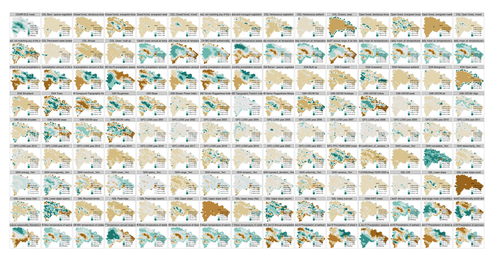
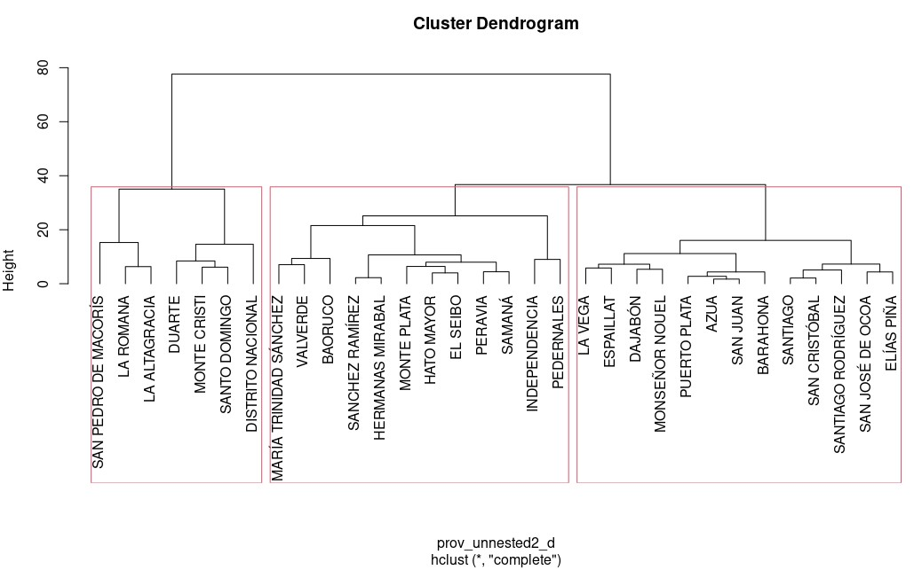
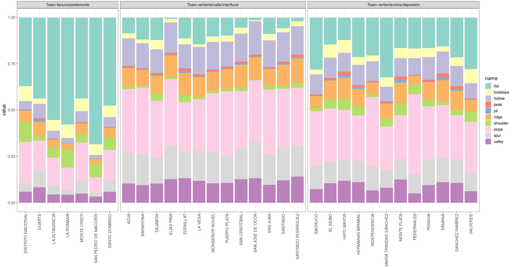
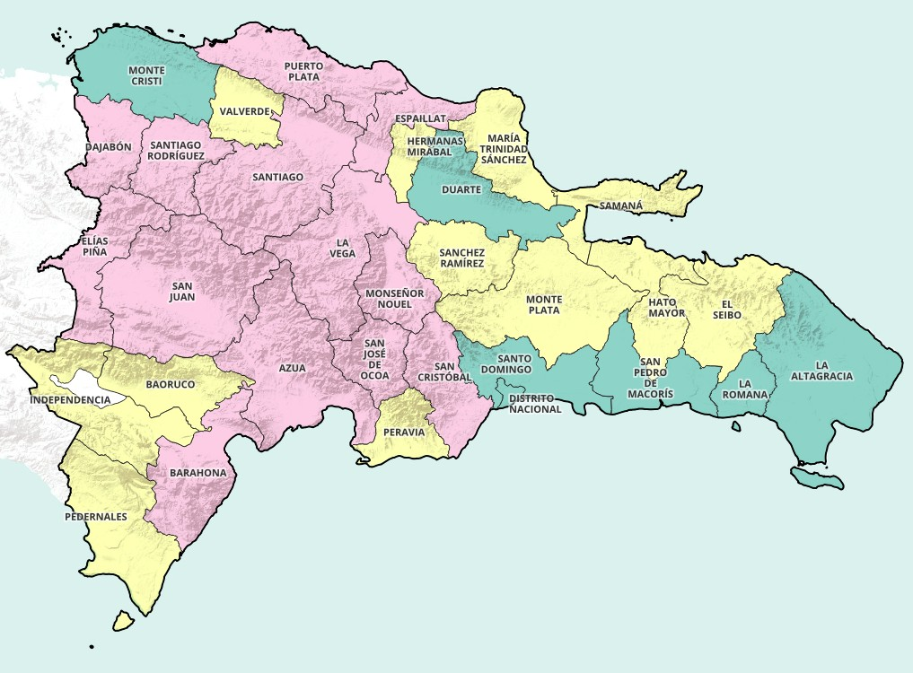

```{r setup, include=FALSE}
knitr::opts_chunk$set(echo = T, cache = F, eval = F, out.width = '100%', dpi = 300)
```

```{r, echo=F, include=F, eval=T}
res <- 4:7
```

José Ramón Martínez Batlle, Universidad Autónoma de Santo Domingo (UASD) <br> Email: jmartinez19\@uasd.edu.do <br> GitHub: \@geofis <br> `r Sys.Date()` <br> Reportar errores a mi dirección de correo, o creando un *issue* en el repo.

<!-- [](https://doi.org/10.5281/zenodo.6991441) -->

<!-- Citar este repo usando el siguiente formato (entrada BibTeX [aquí](#entrada-bibtex)): "José Ramón Martínez Batlle. (2022). geofis/forest-loss-fire-reproducible: Preparing for publication (v0.0.2). Zenodo. https://doi.org/10.5281/zenodo.6991441" -->

# Introducción

<!-- > Si necesitas descargar los archivos reusltantes, visita [esta ruta](out/) o descarga el comprimido del repo [aquí]() -->

> Si quieres consultar el código con el que generé los archivos resultantes del *spatial binning*, visita [esta](#cloud-processing-gee-and-post-processing-in-r) sección.

`r if(knitr::opts_knit$get("rmarkdown.pandoc.to") == 'gfm-yaml_metadata_block') 'Versión HTML (quizá más legible), [aquí](https://geofis.github.io/zonal-statistics/README.html)'`

`r if(knitr::opts_knit$get("rmarkdown.pandoc.to") == 'latex') 'Versión HTML (quizá más legible), [aquí](https://geofis.github.io/zonal-statistics/README.html)'`


En ecología numérica, y en biogeografía, se suele denominar "variables ambientales" o "variables de hábitat", a un conjunto de atributos del medio físico y biótico, usados como factores o "covariables" para explorar asociaciones comunidad-hábitat, y son esenciales en la producción de nuevo conocimiento sobre patrones de distribución de especies y comunidades [@borcard2011; @maestre2008; @wiegand2013]. Cubren, por lo tanto, múltiples aspectos, entre los que destacan topografía, geomorfología, geología, climatología, población humana o densidad de carreteras, entre otros. Durante el siglo pasado, producir variables ambientales era costoso y lento, y su uso se limitaba a ámbitos geográficos muy concretos.

Actualmente, la información ambiental es global y diversa, y su uso en ecología por medio de herramientas de *big data* está en aumento de forma progresiva [@karger2017; @amatulli2020; @tuanmu2015; @zanagadaniele2022]. Buena parte de esta información es generada, originalmente, por sensores a bordo de satélites de observación de la Tierra (e.g. reflectancia de la superficie del planeta por sensores pasivos, o retrodispersión por sensores activos), pero su almacenamiento y posprocesamiento para generar productos derivados, requieren de plataformas con capacidades que superan a los recursos computacionales del PC común.

Los catálogos de información global son producidos por grupos de investigación y académicos de diversos países [@zhao2021; @amani2020; @yang2017], alojados normalmente en repositorios gratuitos y puestos a disposición de la comunidad científica en diversas plataformas de computación en la nube (*cloud computing*) para su aprovechamiento. *Google Earth Engine* (GEE), la plataforma geoespacial de *cloud computing* más popular actualmente, ofrece planes gratuitos de acceso a los datos y a sus recursos de hardware. Aunque con restricciones de almacenamiento y de recursos, GEE permite procesar grandes volúmenes de datos de forma eficiente. También destacan *Microsoft Planetary Computer*, y los entornos de *cloud computing* de Maxar y Planet, que ofrecen imágenes de satélite crudas y colecciones de superficies continuas de variables derivadas (e.g., imágenes ráster, *stacks*), las cuales requieren potentes recursos para su procesamiento en una base de referencia común que permita extraer patrones espaciales [@microsoft2022; @google2022; @planetlabspbc2022; @maxartechnologies2022]. Esta revolución, por una parte, ha impulsado el acceso a un nutrido catálogo de datos ambientales, y por otra ha favorecido el desarrollo de nuevas líneas de estudio en ecología, y ha permitido resolver problemas de investigación que en el pasado jamás se habría pensado que podrían resolverse [@zhao2021].

En República Dominicana (RD), buena parte de la información de ámbito nacional ha permanecido poco accesible al público, y su aprovechamiento en el ámbito de la investigación es limitado. Otras barreras también subyacen en el libre acceso a la información pública dominicana, como lo es el requisito de motivar las razones de petición de datos [@darbishire2006; @congreso2004]. A pesar de ello, a mediados de la década del 10 de este siglo, existía evidencia de que, gracias al mayor acceso a información pública, los reclamos de la población hacia sus autoridades se encontraban en aumento, una señal inequívoca de progreso [@skoufias2014].

Aunque se requieren evaluaciones específicas, la producción de datos de escala nacional, parecía emplear metodologías no reproducibles y, en algunos casos, no declaradas. A esto se sumaba el hecho que, buena parte de la información que sí era accesible, había sido generada con referencia a unidades administrativas "al uso", las cuales abarcaban territorios heterogéneos. Otra dificultad asociada era el hecho de que diversos estudios produjeron mapas sin tener en cuenta potenciales usos posteriores, por lo que su reaprovechamiento requería de un esfuerzo previo de depuración y normalización. Todo ello repercutía sobre la producción de conocimiento científico de forma significativa, pues tanto personal investigador como estudiantes, veían limitadas sus capacidades de análisis por falta de fuentes de información sistemáticas.

En el presente estudio, me propuse llenar el vacío de información sistemática y reaprovechable sobre RD, mediante la consolidación, con *scripts* reproducibles, de capas de datos ambientales abiertos, accesibles e indexados espacialmente. Específicamente, por medio estadística zonal indexando por celdas regulares, calculé promedios y otros estadísticos sobre variables que representan atributos topográficos, geomorfológicos, de uso y cobertura del suelo, climátológicos, de hetereogeneidad de hábitat, de carreteras y de población, entre otros. El conjunto de mapas generados es una fuente de información con gran potencial para su uso en distintos ámbitos de la ecología numérica, en biogeografía y en otras áreas de la biología y la geografía. Asimismo, la metodología empleada tiene potencial de aplicación en estudios posteriores que requieran de datos sistemáticamente generados y accesibles.

# Metodología

Produje información territorial usando estadística zonal (agrupamiento espacial o *spatial binning*) referido a celdas hexagonales de la biblioteca H3 (e.g. índice espacial) de República Dominicana, a [resoluciones](https://h3geo.org/docs/core-library/restable/) `r res` [@bivand2013; @handbook2010]. Para este cometido, desarrollé *scripts* y funciones de Python y de R, con las que aproveché tanto el catálogo de información como los recursos de computación en la nube (*cloud computing*) de Google Earth Engine (GEE). Adicionalmente, a título demostrativo, desarrollé un enfoque de procesamiento más modesto, usando igualmente código informático y fuentes de información alojadas en PC local. En las subsecciones a continuación, amplío los pormenores de ambos enfoques.

## Procesamiento usando GEE, Python y R

Esta modalidad consistió en procesar grandes volúmenes de datos espaciales en Google Earth Engine (GEE), una plataforma de computación en la nube que se erige como un referente en materia de big data geoespacial, pues cuenta con un nutrido catálogo de fuentes del orden de petabytes de información, así como con múltiples algoritmos de análisis geoespacial [@zhao2021].

En GEE realicé *spatial binning* sobre celdas hexagonales H3, usando como capas de "valor" múltiples variables disponibles como *assets* en GEE. Estas capas de valores reunían variables tanto cualitativas como cuantitativas, alojadas previamente como *assets* del catálogo del GEE, o subidas exprofeso como *assets* de usuario a dicha plataforma. Las variables disponibles en GEE abarcan atributos muy diversos, tales como topográficos, morfológicos, de uso y cobertura del suelo, climáticos, de hetereogeneidad de hábitat, de carreteras y de población. La ejecución de algoritmos de estadística zonal con GEE fue bastante eficiente, pues los tiempos de computación para generar estadísticos zonales fueron siempre inferiores a diez segundos.

> ToDo. Realizar estadística zonal por unidades administrativas del país para fines informativos. Ver ejemplo [aquí](#geomorpho90m-geomorphons-qualitative-variables-provinces-as-zones)

Las instrucciones para el procesamiento en la nube fueron enviadas a la API del GEE por medio de un *script* de Python (especialmente de la librería `ee`), el cual se encuentra disponible en este [Jupyter Notebook](gee_python/zonal_statistics_using_ee.ipynb). Una vez descargados los resultados del *spatial binning* a la PC local, se aplicó posproceso con scripts y funciones de R para unir capas y desagrupar atributos anidados de las variables cualitativas (e.g. cobertura del suelo).

Para las variables cuantitativas se obtuvo la **media en su escala de medición original para cada celda H3**, y de las cualitativas se obtuvo **la frecuencia relativa de representación de cada clase respecto del total de píxeles con datos en cada celda H3** (más detalles, en la sección [The Python code](#the-python-code)). En este último caso, fue necesario realizar posproceso en R para "desagrupar" (*unnest*) los resultados anidados descargados desde GEE (e.g. diccionarios de Python). Finalmente, como parte del posproceso en R, se realizaron uniones de resultados y exportación. La lista de fuentes empleadas se encuentra en la tabla \@ref(tab:fuentes).

```{r fuentes, eval=T, results='asis', echo=F, message=F, warning=F}
library(kableExtra)
library(dplyr)
tabla_fuentes <- readODS::read_ods('ref/tabla-de-fuentes.ods')
tabla_fuentes %>% 
  mutate(across(everything(), ~ ifelse(is.na(.x), '', .x))) %>%
  mutate(across(everything(), ~ gsub('(\\*)(.*)(\\*)', '<i>\\2</i>', .x))) %>% 
  # mutate(across(5:7, ~ ifelse(.x=='No disponible', 'No disponible', paste0("<a href=\"", .x,"\">", .x, "</a>")))) %>%
  # mutate(across(everything(),
  #               ~ ifelse(.x=='No disponible', 'No disponible',
  #                        gsub('(http.*)(\\s|$|\\))',
  #                             paste0("<a href=\"", "\\1","\">", "fuente", "</a>\\2"),
  #                             .x)))) %>%
  mutate(across(everything(),
                ~ ifelse(.x=='No disponible', 'No disponible',
                         gsubfn::gsubfn(
                           '(http.*?)(\\s|$|\\))',
                           ~ paste0("<a href=\"", x,"\">", substr(gsub('http.*?//', '', x), 1, 25), "... </a>", y), 
                              .x)))) %>%
  kable(format = 'html', escape = F, booktabs = T,
        caption = 'Fuentes a las que se aplicaron los algoritmos de estadística zonal') %>%
  kable_styling(bootstrap_options = c("hover", "condensed"), full_width = T) %>%
  column_spec(column = c(2, 8), width_min = '4in') %>% 
  column_spec(column = c(1,3:7), width_min ='2in', width_max = '4in')
```

> ToDo. Añadir fuentes: (1) distancia a cursos fluviales; (2) cuencas y red de drenaje

> Nuevas variables y métodos de agrupamiento podrían añadirse progresivamente al repo.

## Procesamiento demostrativo usando *scripts* y funciones de R

Aunque el uso de GEE contribuyó a alcanzar los objetivos de manera más ágil, esto no me impidió ver los potenciales riesgos de dependencia que entraña el servicio en la nube. Por esta razón, alternativamente, y en adición al procesamiento realizado en GEE, creé un conjunto de funciones y *scripts* de R para realizar cómputos de estadística zonal en PC local. Esta modalidad está dirigida a usuarios que prefieren usar recursos de hardware propios, y para quienes manejan volúmenes de datos relativamente pequeños (e.g., ráster de resolución espacial intermedia).

Escribí funciones y *scripts* R para realizar cálculos de *spatial binning*, y pensados para el usuario de PC de escritorio, usando un conjunto de paquetes de información geoespacial eficientes y actuales para el entorno de programación estadística R [@pebesma2018; @hijmans2022; @pebesma2022; @rcoreteam2021]. Esta modalidad está dirigida a usuarios que no disponen de las habilidades de programación en el GEE, o que simplemente necesitan realizar sencillas operaciones de procesamiento geoespacial en PC local sin necesidad de depender de la nube de computación ni de licencias de software privativo.

A modo de demostración, probé estos algoritmos con conjuntos de datos pequeños y obtuve resultados similares a los obtenidos por medio de GEE. No obstante, dado el alto volumen de datos procesados para toda República Dominicana, opté por usar las herramientas y recursos de GEE para generar los productos de este estudio.

# Resultados

## Variables disponibles

```{r cargar_nombres_vars, eval=T, include=F}
# Number of variables by source
suffixes <- c('ESA', 'CGL', 'GSL', 'GHH', 'WCL', 'CH-BIO', 'G90', 'G90-GEOM',
              'CGIAR-ELE', 'GFC-PTC YEAR 2000', 'GFC-LOSS', 'OSM-DIST', 'GP-CONSUNadj YEAR 2020')
merge_quant_qual_l <- readRDS('out/list_with_all_sources_all_resolution.RDS')
uniq_names <- unique(unlist(sapply(merge_quant_qual_l, colnames, simplify = F)))
uniq_names_thematic <- grep('hex_id| base$|^geometry$', uniq_names,
                                 invert = T, value = T)
uniq_names_t <- sapply(suffixes, function(x) length(grep(paste0('^', x, ' '), uniq_names_thematic)))
# uniq_names_t[order(names(uniq_names_t))] #Properly sorted by name
```

Relaciono las variables disponibles en la tabla \@ref(tab:variables)

```{r variables, eval=T, results='asis', echo=F, message=F, warning=F}
library(kableExtra)
library(dplyr)
library(stringr)
#Relación de variables en cada grupo
relacion_vars_grupos <- sapply(suffixes, function(x) grep(paste0('^', x, ' '), uniq_names_thematic, value = T))
# cat(gsub('G90 ', '', relacion_vars_grupos$G90), sep = '; ')
tabla_vars <- readODS::read_ods('ref/tabla-variables.ods')
tabla_vars %>%
  mutate(across(everything(), ~ ifelse(is.na(.x), '', .x))) %>%
  mutate(across(everything(), ~ gsub('(\\*)(.*)(\\*)', '<i>\\2</i>', .x))) %>%
  mutate(across(everything(),
                ~ ifelse(.x=='No disponible', 'No disponible',
                         gsub('(http.*?)(\\s|$|\\))',
                              paste0("<a href=\"", "\\1","\">", "esta fuente", "</a>\\2"),
                              .x)))) %>%
  kable(format = 'html', escape = F, booktabs = T,
        caption = 'Relación de variables') %>%
  kable_styling(bootstrap_options = c("hover", "condensed"), full_width = T) %>% 
  column_spec(column = 6, width_min ='4in') %>% 
  column_spec(column = 2, width_min ='3in') %>% 
  column_spec(column = 4:5, width_min ='2in', width_max = '4in')
```



## Archivos resultantes de estadística zonal (*spatial binning*) según celdas

Consulta los archivos resultantes por resolución de celdas H3, en [este directorio](out/). Los encontrarás en dos formatos:

- R, archivo de extensión `RDS` (todas las resoluciones en objeto tipo lista).

- GeoPackage, archivos de extensión `gpkg` (un archivo por cada resolución). Ideal abrirlo en QGIS.

El numeral que sigue a la cadena `res_` se refiere a la resolución. Por ejemplo, el archivo de resolución 4, es `all_sources_all_variables_res_4.gpkg`.

# Información suplementaria

<!-- <ENG> -->

<!-- This repo consolidates my (\@geofis) latest zonal statistics workflows using Google Earth Engine results, as well as my own R functions which generates zonal statistics from rasters and vectors. -->

<!-- </ENG> -->

# Cloud processing (GEE) and post-processing in R

## The Python code {#the-python-code}

See Jupyter Notebook [here](gee_python/zonal_statistics_using_ee.ipynb).

In this section, I include examples on how to properly extract the zonal statistics results generated by the Google Earth Engine. The sources for this examples are mean values of quantitative layers, as well as percentages of cover of qualitative variables for each H3 hexagon at different resolutions (4 through 7). In EE, I generate GeoDataFrames which I process with R code.

This is the EE code that generates mean values of quantitative variables for each H3 hexagon:

```{python, eval=F}
import geopandas as gpd
zone_stats = image.reduceRegions(collection=features, reducer=ee.Reducer.mean(), scale=image.projection().nominalScale(), tileScale=1).getInfo()
zone_stats = gpd.GeoDataFrame.from_features(zone_stats, crs='epsg:4326')
zone_stats.fillna(0, inplace=True)
```

This is the EE code that generates percentages of cover of qualitative variables for each H3 hexagon:

```{python, eval=F}
import geopandas as gpd
zone_stats = image.reduceRegions(collection=features, reducer=ee.Reducer.frequencyHistogram(), scale=image.projection().nominalScale(), tileScale=1).getInfo()
zone_stats = gpd.GeoDataFrame.from_features(zone_stats, crs='epsg:4326')
zone_stats
```

Then, I exported every zonal stats generated with this sample code:

```{python, eval=F}
zone_stats.to_file(filename='output_geopackage.gpkg', driver='GPKG', layer='layer name')
```

## Unnesting dictionary columns from qualitative source

In this section, I include the code used to convert the key + frequencies dictionary column generated in EE, to named unnested columns. I also merge, at the end of this section, all the variables obtained for each resolution level, including the quantitative ones.

### Load tools and define paths

```{r}
library(tmap)
library(tidyverse)
source('R/unnest-qual-zonal-stats.R')
source('R/merge-sf.R')
source('R/st-read-rename-cols-based-on-prefix.R')
results_path <- 'gee_python/out/result_layers/'
final_results <- 'out/'
```

### Global SRTM Landforms

```{r}
# Base name
base_name <- 'global_srtm_landforms_res_'

# Merge res_7 gpkg
build_name <- function(x) gsub('#', x, 'global_srtm_landforms#_res_7.gpkg')
gsl_res7 <- merge_sf(paste0(results_path, c(build_name('1'), build_name('2'), build_name('3'))))
# st_write(gsl_res7, paste0(results_path, base_name, '7.gpkg'), delete_dsn = T)

# Batch unnesting
batch_unnest(
  res_available = 4:7,
  base_name = base_name,
  results_path = results_path,
  eqv_tab_filename = 'global_SRTM_landforms_value_description_equivalencies.csv')
```

### ESA WorldCover 2021, 10m v200

```{r}
# Base name
base_name <- 'esa_worldcover_10m_v200_res_'

# Merge res_7 gpkg
build_name <- function(x) gsub('#', x, 'esa_worldcover_10m_v200_#_res_7.gpkg')
ewc_res7 <- merge_sf(paste0(results_path, c(build_name('1'), build_name('2'), build_name('3'))))
# st_write(ewc_res7, paste0(results_path, base_name, '7.gpkg'), delete_dsn = T)

# Batch unnesting
batch_unnest(
  res_available = 4:7,
  base_name = base_name,
  results_path = results_path,
  eqv_tab_filename = 'esa_worldcover_10m_v200_res_4_value_description_equivalencies.csv')
```

### Copernicus Global Land Cover Layers: CGLS-LC100 Collection 3

```{r}
# Base name
base_name <- 'copernicus_global_landcover_100m_res_'

# Merge res_7 gpkg
build_name <- function(x) gsub('#', x, 'copernicus_global_landcover_100m_#_res_7.gpkg')
cgl_res7 <- merge_sf(paste0(results_path, c(build_name('1'), build_name('2'), build_name('3'))))
# st_write(cgl_res7, paste0(results_path, base_name, '7.gpkg'), delete_dsn = T)

# Batch unnesting
batch_unnest(
  res_available = 4:7,
  base_name = base_name,
  results_path = results_path,
  eqv_tab_filename = 'copernicus_global_landcover_value_description_equivalencies.csv')
```

### Global Habitat Heterogeneity

```{r}
# Base name
base_name <- 'global_habitat_heterogeneity_res_'

# Merge res_7 gpkg
build_name <- function(x) gsub('#', x, 'global_habitat_heterogeneity#_res_7.gpkg')
ghh_res7 <- merge_sf(paste0(results_path, c(build_name('1'), build_name('2'), build_name('3'))))
# st_write(ghh_res7, paste0(results_path, base_name, '7.gpkg'), delete_dsn = T)
```

### WorldClim V1 BIO variables

```{r}
# Base name
base_name <- 'worldclim_v1_bio_variables_res_'

# Merge res_7 gpkg
build_name <- function(x) gsub('#', x, 'worldclim_v1_bio_variables_#_res_7.gpkg')
wcv1bio_res7 <- merge_sf(
  paste0(results_path, c(build_name('1'), build_name('2'), build_name('3'))))
# st_write(wcv1bio_res7, paste0(results_path, base_name, '7.gpkg'), delete_dsn = T)
```

### Geomorpho90m

#### Geomorpho90m (quantitative variables)

```{r}
# Base name
base_name <- 'geomorpho90m_res_'

# Merge res_7 gpkg
build_name <- function(x) gsub('#', x, 'geomorpho90m_#_res_7.gpkg')
geom90m_res7 <- merge_sf(
  paste0(results_path, c(build_name('1'), build_name('2'), build_name('3'))))
# st_write(geom90m_res7, paste0(results_path, base_name, '7.gpkg'), delete_dsn = T)
```

#### Geomorpho90m, geomorphons (qualitative variables)

```{r}
# Base name
base_name <- 'geomorpho90m_geomorphons_res_'

# Merge res_7 gpkg
build_name <- function(x) gsub('#', x, 'geomorpho90m_geomorphons_#_res_7.gpkg')
geom90mgeo_res7 <- merge_sf(paste0(results_path, c(build_name('1'), build_name('2'), build_name('3'))))
# st_write(geom90mgeo_res7, paste0(results_path, base_name, '7.gpkg'), delete_dsn = T)

# Batch unnesting
batch_unnest(
  res_available = 4:7,
  base_name = base_name,
  results_path = results_path,
  eqv_tab_filename = 'geomorpho90m_geomorphons.csv')
```

#### Geomorpho90m, geomorphons (qualitative variables) USING PROVINCES AS ZONES and cluster analysis {#geomorpho90m-geomorphons-qualitative-variables-provinces-as-zones}

```{r}
# Adapt to functions (ToDo: generalize functions)
foo <- st_read('gee_python/out/result_layers/geomorpho90m_geomorphons_prov_res_1.gpkg')
colnames(foo)[grep('TOPONIMIA', colnames(foo))] <- 'hex_id'
st_write(foo %>% select(hex_id, geom, histogram), delete_dsn = T,
         'gee_python/out/result_layers/geomorpho90m_geomorphons_prov2_res_1.gpkg')

# Base name
base_name <- 'geomorpho90m_geomorphons_prov2_res_'

# Batch unnesting
batch_unnest(
  res_available = 1,
  base_name = base_name,
  results_path = results_path,
  eqv_tab_filename = 'geomorpho90m_geomorphons.csv')

# Clusters
library(tidyverse)
library(vegan)
library(cluster)
library(gclus)
library(sf)
devtools::source_url('https://raw.githubusercontent.com/biogeografia-master/scripts-de-analisis-BCI/master/biodata/funciones.R')
prov_unnested <- st_read('gee_python/out/result_layers/geomorpho90m_geomorphons_prov2_res_1_unnested.gpkg')
prov_unnested2 <- prov_unnested %>% st_drop_geometry() %>% column_to_rownames('hex_id') %>% select(-base)
prov_unnested2_d <- vegdist(prov_unnested2, "euc")
lista_cl <- list(
        cl_single = hclust(prov_unnested2_d, method = 'single'),
        cl_complete = hclust(prov_unnested2_d, method = 'complete'),
        cl_upgma = hclust(prov_unnested2_d, method = 'average'),
        cl_ward = hclust(prov_unnested2_d, method = 'ward.D2')
)
# dev.new()
par(mfrow = c(2,2))
invisible(map(names(lista_cl), function(x) plot(lista_cl[[x]], main = x, hang = -1)))
par(mfrow = c(1,1))
anch_sil <- calcular_anchuras_siluetas(
        mc_orig = prov_unnested2, 
        distancias = prov_unnested2_d, 
        cluster = lista_cl$cl_complete
        # cluster = lista_cl$cl_ward
        # cluster = lista_cl$cl_upgma
        )
anch_sil
u_dend_reord <- reorder.hclust(lista_cl$cl_complete, prov_unnested2_d)
plot(u_dend_reord, hang = -1)
rect.hclust(
        tree = u_dend_reord,
        k = 3)
corte_k3 <- cutree(lista_cl$cl_complete, k = 3)
prov_unnested$grp <- corte_k3
# #st_write(prov_unnested, 'gee_python/out/result_layers/geomorpho90m_geomorphons_prov2_res_1_unnested_grp.gpkg')
prov_unnested %>% st_drop_geometry() %>% select(-base) %>% pivot_longer(cols = flat:valley) %>%
  mutate(hex_id = fct_reorder(hex_id, grp)) %>% 
  mutate(grp = factor(grp, labels = c(
    'Team llanura/piedemonte',
    'Team vertiente/valle/interfluvio',
    'Team vertiente/cima/depresión'))) %>% 
  ggplot + aes(fill = name, y = value, x = hex_id) +
  geom_bar(position="fill", stat="identity", ) +
  scale_fill_brewer(palette = "Set3") +
  # annotate(xmin = 'DISTRITO NACIONAL', xmax = 'SANTO DOMINGO', ymin = -Inf, ymax = Inf, geom = 'rect', alpha = 0.2) +
  facet_grid(~ grp, scales = 'free_x', space = 'free') + theme_bw() +
  theme(axis.text.x = element_text(angle = 90, vjust = 0.5, hjust=1), text = element_text(size=14))
```

-   Provincias agrupadas según su composición por "geomórfonos". Las provincias son unidades muy heterogéneas en cuanto a su composición fisiográfica. Este gráfico lo demuestra y, aun con toda su heterogeneidad, hay tres grupos de provincias diferenciados



 

### CGIAR Elevation SRTM90 V4

```{r}
# Base name
base_name <- 'cgiar_elevation_srtm90v4_res_'

# Merge res_7 gpkg
build_name <- function(x) gsub('#', x, 'cgiar_elevation_srtm90v4_#_res_7.gpkg')
srtm90v4_res7 <- merge_sf(
  paste0(results_path, c(build_name('1'), build_name('2'), build_name('3'))))
# st_write(srtm90v4_res7, paste0(results_path, base_name, '7.gpkg'), delete_dsn = T)
```

### CHELSA v21 BIO variables

-   Prepare layers for uploading. Export TIF files to reduce their size and to conform EE standard.

```{bash, eval=F}
for i in *tif; do i=${i/.tif/}; gdal_translate -a_nodata 65535 \
  -co COMPRESS=DEFLATE -projwin -75.0 20.5 -68.0 17.4 -of GTiff \
  ${i}.tif ${i}_nd_crop.tif; done
```

-   Uploaded the files generated to EE.

-   Processed with the Jupyter Notebook `zonal_statistics_using_ee.ipynb`, and then post-processed the results as follows:

```{r}
# Base name
base_name <- 'chelsa_v21_bio_variables_res_'

# Merge res_7 gpkg
build_name <- function(x) gsub('#', x, 'chelsa_v21_bio_variables_#_res_7.gpkg')
chelsav21bio_res7 <- merge_sf(
  paste0(results_path, c(build_name('1'), build_name('2'), build_name('3'))))
# st_write(chelsav21bio_res7, paste0(results_path, base_name, '7.gpkg'), delete_dsn = T)
```

### Hansen et al. (2013)

#### Year-2000 percent tree cover (quantitative)

```{r}
# Base name
base_name <- 'hansen_gfc_v19_ptc_y2000_res_'

# Merge res_7 gpkg
build_name <- function(x) gsub('#', x, 'hansen_gfc_v19_ptc_y2000_#_res_7.gpkg')
hansengfcv19ptc_res7 <- merge_sf(
  paste0(results_path, c(build_name('1'), build_name('2'), build_name('3'))))
# st_write(hansengfcv19ptc_res7, paste0(results_path, base_name, '7.gpkg'), delete_dsn = T)
```

#### Year of forest loss (qualitative)

```{r}
# Base name
base_name <- 'hansen_gfc_v19_ly_res_'

# Merge res_7 gpkg
build_name <- function(x) gsub('#', x, 'hansen_gfc_v19_ly_#_res_7.gpkg')
hansengfcv19ly_res7 <- merge_sf(paste0(results_path, c(build_name('1'), build_name('2'), build_name('3'))))
# st_write(hansengfcv19ly_res7, paste0(results_path, base_name, '7.gpkg'), delete_dsn = T)

# Batch unnesting
batch_unnest(
  res_available = 4:7,
  base_name = base_name,
  results_path = results_path,
  eqv_tab_filename = 'hansen_gfc_v19_loss_year_value_description_equivalencies.csv')
map(
  .x = 4:7,
  .f = function(x) {
    foo <- st_read(paste0(results_path, 'hansen_gfc_v19_ly_res_', x, '_unnested.gpkg'), optional=T) %>% 
      relocate(all_of(sort(grep('hex_id|geom', colnames(.), value = T, invert = T))), .after = last_col())
    st_write(foo, paste0(results_path, 'hansen_gfc_v19_ly_res_', x, '_unnested2.gpkg'))}
)
```

### Distance to OSM roads and trails

-   Downloaded OSM database of DR and Haiti. For this, pressed the Export button from OSM web GUI while logged in.

-   Selected "Downloads from Geofabrik".

-   Then clicked over "Central America \> Haiti and Dominican Republic"

-   Clicked [haiti-and-domrep-latest-free.shp.zip](https://download.geofabrik.de/central-america/haiti-and-domrep-latest-free.shp.zip).

-   Reprojected `gis_osm_roads_free_1.shp` file to UTM:

```{python, eval=F}
"{ 'INPUT' : 'gis_osm_roads_free_1.shp', 'OPERATION' : '+proj=pipeline +step +proj=unitconvert +xy_in=deg +xy_out=rad +step +proj=utm +zone=19 +ellps=WGS84', 'OUTPUT' : 'gis_osm_roads_free_1_utm.shp', 'TARGET_CRS' : QgsCoordinateReferenceSystem('EPSG:32619') }"
```

-   Generated a raster file of ~ 1/3 arc-second (10 m) from `gis_osm_roads_free_1_utm.shp`, with:

```{bash, eval=F}

gdal_rasterize -l gis_osm_roads_free_1_utm -burn 1.0 \
  -tr 10.0 10.0 -a_nodata 0.0 \
  -te 161500 1897000 593020 2250010 -ot Float32 -of GTiff \
  gis_osm_roads_free_1_utm.shp \
  osm_roads_1_arc_sec_utm.tif
```

-   Generated a distance raster with:

```{bash, eval=F}
gdal_proximity.py -srcband 1 -distunits GEO \
  -ot Float32 -of GTiff \
  osm_roads_1_arc_sec_utm.tif \
  osm_roads_1_arc_sec_utm_dist.tif
```

-   Warped to 4326 and masked:

```{bash, eval=F}
gdalwarp -overwrite -s_srs EPSG:32619 -t_srs EPSG:4326 -of GTiff -co COMPRESS=DEFLATE \
  -dstnodata -3.402823466e+38 -cutline dr.gpkg -cl pais -crop_to_cutline \
  osm_roads_1_arc_sec_utm_dist.tif \
  osm_roads_1_arc_sec_ll_dist_clipped.tif
```

-   Finally, the processing of the 3 chunks of resolution-7 hexagons (merging)

```{r}
# Base name
base_name <- 'distance_to_osm_roads_res_'

# Merge res_7 gpkg
build_name <- function(x) gsub('#', x, 'distance_to_osm_roads_#_res_7.gpkg')
distosmroads_res7 <- merge_sf(
  paste0(results_path, c(build_name('1'), build_name('2'), build_name('3'))))
# st_write(distosmroads_res7, paste0(results_path, base_name, '7.gpkg'), delete_dsn = T)
```

### WorldPop Global Project Population Data: Constrained Estimated Age and Sex Structures of Residential Population per 100x100m Grid Square (UN adjusted)

```{r}
# Base name
base_name <- 'worldpop_gp_constrained_unadj_2020_res_'

# Merge res_7 gpkg
build_name <- function(x) gsub('#', x, 'worldpop_gp_constrained_unadj_2020_#_res_7.gpkg')
worldpopconsunadj2020_res7 <- merge_sf(
  paste0(results_path, c(build_name('1'), build_name('2'), build_name('3'))))
# st_write(worldpopconsunadj2020_res7, paste0(results_path, base_name, '7.gpkg'), delete_dsn = T)
```

## Merge all the GeoPackages in one

```{r}
res <- 4:7
merge_quant_qual_l <- map(4:7, function(res) {
  first_sf <- list(
    st_read_rename(
      paste0(results_path, 'esa_worldcover_10m_v200_res_', res, '_unnested.gpkg'),
      col_prefix = suffixes[1]))
  remainder_sf <- purrr::map2(
    paste0(
      results_path,
      c(paste0('copernicus_global_landcover_100m_res_', res, '_unnested.gpkg'),
        paste0('global_srtm_landforms_res_', res, '_unnested.gpkg'),
        paste0('global_habitat_heterogeneity_res_', res, '.gpkg'),
        paste0('worldclim_v1_bio_variables_res_', res, '.gpkg'),
        paste0('chelsa_v21_bio_variables_res_', res, '.gpkg'),
        paste0('geomorpho90m_res_', res, '.gpkg'),
        paste0('geomorpho90m_geomorphons_res_', res, '_unnested.gpkg'),
        paste0('cgiar_elevation_srtm90v4_res_', res, '.gpkg'),
        paste0('hansen_gfc_v19_ptc_y2000_res_', res, '.gpkg'),
        paste0('hansen_gfc_v19_ly_res_', res, '_unnested.gpkg'),
        paste0('distance_to_osm_roads_res_', res, '.gpkg'),
        paste0('worldpop_gp_constrained_unadj_2020_res_', res, '.gpkg'))),
    suffixes[2:length(suffixes)],
    st_read_rename, first = F)
  merge_quant_qual <- Reduce(
    function(...) merge(..., by='hex_id', all.x=TRUE),
    c(first_sf, remainder_sf))
  return(merge_quant_qual)
})
names(merge_quant_qual_l) <- paste('H3 resolution:', 4:7)
merge_quant_qual_l
saveRDS(merge_quant_qual_l, paste0(final_results, 'list_with_all_sources_all_resolution.RDS'))
map(1:4, function(x)
  st_write(
    obj = merge_quant_qual_l[[x]],
    dsn = paste0(final_results, 'all_sources_all_variables_res_', 3 + x, '.gpkg'),
    delete_dsn = T))

# All variables!!
# jpeg('img/all_vars_res_5.jpg', width = 3840, height = 2032, res = 250)
all_vars_res_5 <- merge_quant_qual_l$`H3 resolution: 5` %>%
  select(-matches(c('hex_id| base|^WCL bio19'))) %>%
  pivot_longer(names_to = 'variable', values_to = 'value', -geometry) %>%
  tm_shape() +
  tm_fill(col='value', palette = "BrBG", size = 0.1, style = 'fisher', legend.is.portrait = T) +
  tm_borders(col = 'grey15', lwd = 0.3) +
  tm_facets(by = "variable", ncol = 15, nrow = 9, free.coords = FALSE, free.scales = TRUE) +
  tm_layout(panel.label.size = 1.5, legend.title.size = 1,
            legend.text.size = 1, legend.position = c('right', 'bottom'))
all_vars_res_5
# dev.off()

merge_quant_qual_l$`H3 resolution: 7` %>% select(matches('^WCL')) %>%
  pivot_longer(names_to = 'variable', values_to = 'value', -geometry) %>%
  tm_shape() +
    tm_fill(col='value', palette = "BrBG", size = 0.1, style = 'fisher', legend.is.portrait = T) +
    tm_borders(col = 'grey15', lwd = 0.3) +
    tm_facets(by = "variable", ncol = 5, nrow = 4, free.coords = FALSE, free.scales = TRUE) +
    tm_layout(panel.label.size = 1.5, legend.title.size = 1, legend.text.size = 1, legend.position = c('right', 'bottom'))

merge_quant_qual_l$`H3 resolution: 6` %>% select(matches('^CH-BIO')) %>%
  pivot_longer(names_to = 'variable', values_to = 'value', -geometry) %>%
  tm_shape() +
    tm_fill(col='value', palette = "BrBG", size = 0.1, style = 'fisher', legend.is.portrait = T) +
    tm_borders(col = 'grey15', lwd = 0.3) +
    tm_facets(by = "variable", ncol = 5, nrow = 4, free.coords = FALSE, free.scales = TRUE) +
    tm_layout(panel.label.size = 1.5, legend.title.size = 1, legend.text.size = 1, legend.position = c('right', 'bottom'))

merge_quant_qual_l$`H3 resolution: 7` %>% select(matches('^ESA'), -matches('base')) %>%
  pivot_longer(names_to = 'variable', values_to = 'value', -geometry) %>%
  tm_shape() +
    tm_fill(col='value', palette = "BrBG", size = 0.1, style = 'fisher', legend.is.portrait = T) +
    tm_borders(col = 'grey15', lwd = 0.3) +
    tm_facets(by = "variable", ncol = 3, nrow = 3, free.coords = FALSE, free.scales = TRUE) +
    tm_layout(panel.label.size = 1.5, legend.title.size = 1, legend.text.size = 1, legend.position = c('right', 'bottom'))

merge_quant_qual_l$`H3 resolution: 6` %>% select(matches('^G90-GEOM'), -matches('base')) %>%
  pivot_longer(names_to = 'variable', values_to = 'value', -geometry) %>%
  tm_shape() +
    tm_fill(col='value', palette = "-BrBG", size = 0.1, style = 'fisher', legend.is.portrait = T) +
    tm_borders(col = 'grey15', lwd = 0.3) +
    tm_facets(by = "variable", ncol = 4, nrow = 3, free.coords = FALSE, free.scales = TRUE) +
    tm_layout(panel.label.size = 1.5, legend.title.size = 1, legend.text.size = 1, legend.position = c('right', 'bottom')) + 
  tm_shape(st_read('inst/extdata/dr.gpkg')) + 
  tm_borders(col = 'grey15', lwd = 1)

merge_quant_qual_l$`H3 resolution: 6` %>% select(matches('^GSL'), -matches('base')) %>%
  pivot_longer(names_to = 'variable', values_to = 'value', -geometry) %>%
  tm_shape() +
    tm_fill(col='value', palette = "-BrBG", size = 0.1, style = 'fisher', legend.is.portrait = T) +
    tm_borders(col = 'grey15', lwd = 0.3) +
    tm_facets(by = "variable", ncol = 4, nrow = 4, free.coords = FALSE, free.scales = TRUE) +
    tm_layout(panel.label.size = 1.5, legend.title.size = 1, legend.text.size = 1, legend.position = c('right', 'bottom')) + 
  tm_shape(st_read('inst/extdata/dr.gpkg')) + 
  tm_borders(col = 'grey15', lwd = 1)
```

# WITHOUT GOOGLE EARTH ENGINE (value layers dowloaded from original sources)

## Use cases of mean zonal statistics (only for quantitative value layers)

### Load packages and functions

```{r}
library(sf)
library(stars)
library(ggplot2)
source('R/zonal-stats.R')
```

### Using only one single value source

#### Hex grid already available (from file)

```{r}
data_path <- 'inst/extdata/'
dr <- st_read(paste0(data_path, 'dr.gpkg'), layer = 'pais') # From ONE
shannon <- read_stars(paste0(data_path,'shannon_01_05_1km_uint16.tif')) # From Global Habitat Heterogeneity
zones <- readRDS(paste0(data_path, 'sp_index.RDS')) # From h3jsr package, res=5, rd_extra as extent
zs_sp_index_from_file <- zonal_stats(zone = zones, value = shannon, fun = mean, na.rm=T)
zs_sp_index_from_file
ggplot_template <- list(
  geom_sf(lwd=0),
  geom_sf(aes(), fill = NA, data = dr),
  theme_bw(),
  scale_fill_distiller(type = 'seq', palette = 'YlOrBr'))
zs_sp_index_from_file %>%
  dplyr::rename(`Shannon diversity\n(MODIS-EVI)` = shannon_01_05_1km_uint16.tif) %>% 
  ggplot + aes(fill = `Shannon diversity\n(MODIS-EVI)`) + 
  ggplot_template
```

#### Hex grid purpose-built from `zonal_stats` function using a extent polygon from file, WITHOUT buffer zone around the extent polygon

```{r}
dr_extra <- st_read(paste0(data_path, 'dr_extra.gpkg')) # From DR (ONE) GeoPackage > st_buffer, 2km
zs_sp_index_created_no_buf <- zonal_stats(value = shannon, fun = mean, na.rm=T,
                                   resolution = 5, extent = dr_extra)
zs_sp_index_created_no_buf
zs_sp_index_created_no_buf %>%
  dplyr::rename(`Shannon diversity\n(MODIS-EVI)` = shannon_01_05_1km_uint16.tif) %>% 
  ggplot + aes(fill = `Shannon diversity\n(MODIS-EVI)`) + 
  ggplot_template
```

#### Hex grid purpose-built from `zonal_stats` function using a extent polygon from file, WITH buffer zone (2 km) around the extent polygon

```{r}
zs_sp_index_created_buf <- zonal_stats(value = shannon, fun = mean, na.rm=T,
                                   resolution = 5, extent = dr, buffer = 2)
zs_sp_index_created_buf
zs_sp_index_created_buf %>%
  dplyr::rename(`Shannon diversity\n(MODIS-EVI)` = shannon_01_05_1km_uint16.tif) %>% 
  ggplot + aes(fill = `Shannon diversity\n(MODIS-EVI)`) + 
  ggplot_template
```

### Using multiple value sources

#### Same dimensions

```{r}
simpson <- read_stars(paste0(data_path, 'simpson_01_05_1km_uint16.tif'))
all.equal(st_dimensions(shannon), st_dimensions(simpson))
zs_sp_mult_values_same_dim <- zonal_stats(zone = zones, value = c(shannon, simpson), fun = mean, na.rm=T)
zs_sp_mult_values_same_dim
zs_sp_mult_values_same_dim <- zs_sp_mult_values_same_dim %>% 
  dplyr::rename(
    `Shannon diversity (MODIS-EVI)` = shannon_01_05_1km_uint16.tif,
    `Simpson (MODIS-EVI)` = simpson_01_05_1km_uint16.tif)
plot(zs_sp_mult_values_same_dim[c('Shannon diversity (MODIS-EVI)', 'Simpson (MODIS-EVI)')])
```

#### Different dimensions

```{r}
gtopo <- read_stars(paste0(data_path, 'gt30w100n40.tif')) # + GTOPO 30
shannon_redim <- st_warp(shannon, gtopo)
all.equal(st_dimensions(shannon_redim), st_dimensions(gtopo))
zs_sp_mult_values_dif_dim <- zonal_stats(zone = zones, value = c(shannon_redim, gtopo), fun = mean, na.rm=T)
zs_sp_mult_values_dif_dim <- zs_sp_mult_values_dif_dim %>% 
  dplyr::rename(
    `Shannon diversity (MODIS-EVI)` = shannon_01_05_1km_uint16.tif,
    `GTOPO30` = gt30w100n40.tif)
plot(zs_sp_mult_values_dif_dim[c('Shannon diversity (MODIS-EVI)', 'GTOPO30')])
```

## More use cases of loading multiple star sources (not actually for computing zonal stats, only to show ways of building image stacks with `stars`)

### Geomorpho90m

```{r, eval=F}
geomorpho_file_paths <- list.files(
  path = '/media/jose/datos/geomorpho90m/',
  pattern = '_mosaico.tif$', recursive = T, full.names = T)
geomorpho_cube <- read_stars(geomorpho_file_paths)
```

### CHELSA, bio variables (gets locked, even with resolution 4 hexagons). The alternative was GEE.

```{r, eval=F}
chelsa_bio_file_paths <- list.files(
  path = '/media/jose/datos/CHELSA/envicloud/chelsa/chelsa_V2/GLOBAL/climatologies/1981-2010/bio/',
  pattern = '.tif$', recursive = T, full.names = T)
chelsa_bio_cube <- read_stars(chelsa_bio_file_paths)
```

### Entrada Bibtex del repo

```

```


# Referencias