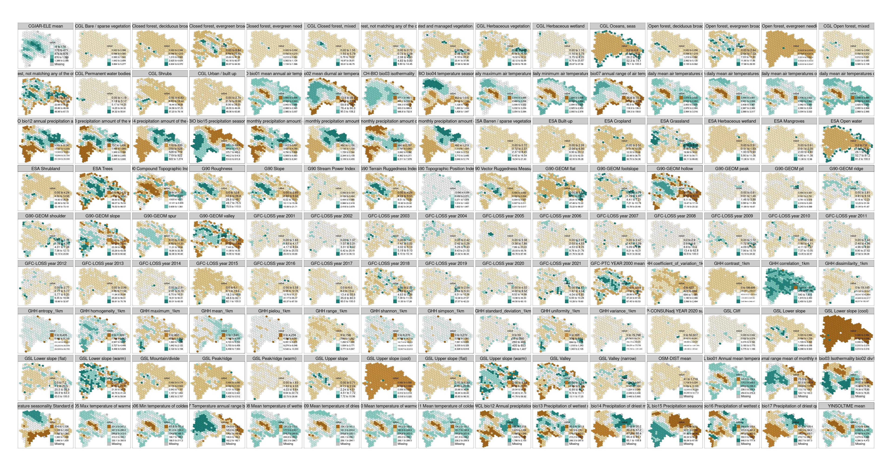
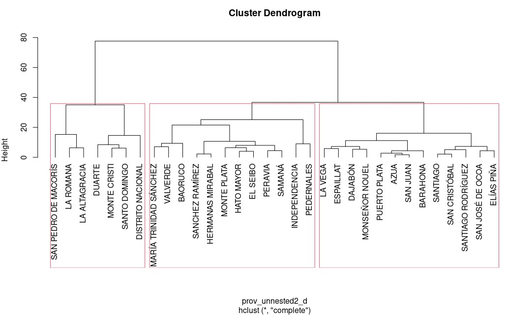
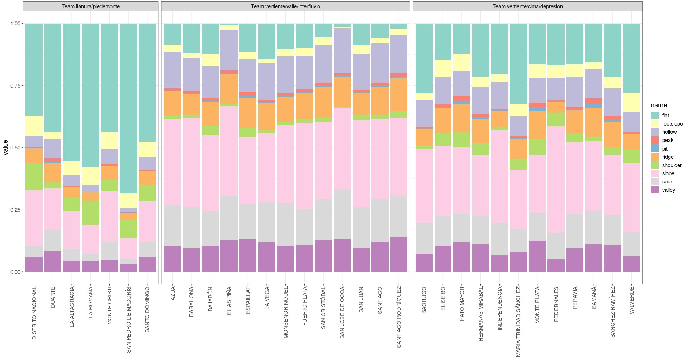

Estadística zonal multipropósito sobre información geoespacial de
República Dominicana, usando Google Earth Engine, Python y R
================

José Ramón Martínez Batlle, Universidad Autónoma de Santo Domingo (UASD)
<br> Email: jmartinez19@uasd.edu.do <br> GitHub: @geofis <br> 2022-11-26
<br> Reportar errores a mi dirección de correo, o creando un *issue* en
el repo.

<!-- [](https://doi.org/10.5281/zenodo.6991441) -->
<!-- Citar este repo usando el siguiente formato (entrada BibTeX [aquí](#entrada-bibtex)): "José Ramón Martínez Batlle. (2022). geofis/forest-loss-fire-reproducible: Preparing for publication (v0.0.2). Zenodo. https://doi.org/10.5281/zenodo.6991441" -->

# 1 Introducción

<!-- > Si necesitas descargar los archivos reusltantes, visita [esta ruta](out/) o descarga el comprimido del repo [aquí]() -->

> Si quieres consultar el código con el que generé los archivos
> resultantes del *spatial binning*, visita
> [esta](#cloud-processing-gee-and-post-processing-in-r) sección.

Versión HTML (quizá más legible),
[aquí](https://geofis.github.io/zonal-statistics/README.html)

En ecología numérica, y en biogeografía, se suele denominar “variables
ambientales” o “variables de hábitat”, a un conjunto de atributos del
medio físico y biótico, usados como factores o “covariables” para
explorar asociaciones comunidad-hábitat, y son esenciales en la
producción de nuevo conocimiento sobre patrones de distribución de
especies y comunidades (Borcard, Gillet, & Legendre, 2011; Maestre,
Escudero, & Bonet, 2008; Wiegand & Moloney, 2013). Cubren, por lo tanto,
múltiples aspectos, entre los que destacan topografía, geomorfología,
geología, climatología, población humana o densidad de carreteras, entre
otros. Durante el siglo pasado, producir variables ambientales era
costoso y lento, y su uso se limitaba a ámbitos geográficos muy
concretos.

Actualmente, la información ambiental es global y diversa, y su uso en
ecología por medio de herramientas de *big data* está en aumento de
forma progresiva (Amatulli, McInerney, Sethi, Strobl, & Domisch, 2020;
Karger et al., 2017; Tuanmu & Jetz, 2015; Zanaga, Daniele et al., 2022).
Buena parte de esta información es generada, originalmente, por sensores
a bordo de satélites de observación de la Tierra (e.g. reflectancia de
la superficie del planeta por sensores pasivos, o retrodispersión por
sensores activos), pero su almacenamiento y posprocesamiento para
generar productos derivados, requieren de plataformas con capacidades
que superan a los recursos computacionales del PC común.

Los catálogos de información global son producidos por grupos de
investigación y académicos de diversos países (Amani et al., 2020; Yang,
Yu, Hu, Jiang, & Li, 2017; Zhao et al., 2021), alojados normalmente en
repositorios gratuitos y puestos a disposición de la comunidad
científica en diversas plataformas de computación en la nube (*cloud
computing*) para su aprovechamiento. *Google Earth Engine* (GEE), la
plataforma geoespacial de *cloud computing* más popular actualmente,
ofrece planes gratuitos de acceso a los datos y a sus recursos de
hardware. Aunque con restricciones de almacenamiento y de recursos, GEE
permite procesar grandes volúmenes de datos de forma eficiente. También
destacan *Microsoft Planetary Computer*, y los entornos de *cloud
computing* de Maxar y Planet, que ofrecen imágenes de satélite crudas y
colecciones de superficies continuas de variables derivadas (e.g.,
imágenes ráster, *stacks*), las cuales requieren potentes recursos para
su procesamiento en una base de referencia común que permita extraer
patrones espaciales (Google, 2022; Maxar Technologies, 2022; Microsoft,
2022; Planet Labs PBC, 2022). Esta revolución, por una parte, ha
impulsado el acceso a un nutrido catálogo de datos ambientales, y por
otra ha favorecido el desarrollo de nuevas líneas de estudio en
ecología, y ha permitido resolver problemas de investigación que en el
pasado jamás se habría pensado que podrían resolverse (Zhao et al.,
2021).

En República Dominicana (RD), buena parte de la información de ámbito
nacional ha permanecido poco accesible al público, y su aprovechamiento
en el ámbito de la investigación es limitado. Otras barreras también
subyacen en el libre acceso a la información pública dominicana, como lo
es el requisito de motivar las razones de petición de datos (Congreso de
la República Dominicana, 2004; Darbishire, 2006). A pesar de ello, a
mediados de la década del 10 de este siglo, existía evidencia de que,
gracias al mayor acceso a información pública, los reclamos de la
población hacia sus autoridades se encontraban en aumento, una señal
inequívoca de progreso (Skoufias, Narita, & Narayan, 2014).

Aunque se requieren evaluaciones específicas, la producción de datos de
escala nacional, parecía emplear metodologías no reproducibles y, en
algunos casos, no declaradas. A esto se sumaba el hecho que, buena parte
de la información que sí era accesible, había sido generada con
referencia a unidades administrativas “al uso”, las cuales abarcaban
territorios heterogéneos. Otra dificultad asociada era el hecho de que
diversos estudios produjeron mapas sin tener en cuenta potenciales usos
posteriores, por lo que su reaprovechamiento requería de un esfuerzo
previo de depuración y normalización. Todo ello repercutía sobre la
producción de conocimiento científico de forma significativa, pues tanto
personal investigador como estudiantes, veían limitadas sus capacidades
de análisis por falta de fuentes de información sistemáticas.

En el presente estudio, me propuse llenar el vacío de información
sistemática y reaprovechable sobre RD, mediante la consolidación, con
*scripts* reproducibles, de capas de datos ambientales abiertos,
accesibles e indexados espacialmente. Específicamente, por medio
estadística zonal indexando por celdas regulares, calculé promedios y
otros estadísticos sobre variables que representan atributos
topográficos, geomorfológicos, de uso y cobertura del suelo,
climátológicos, de hetereogeneidad de hábitat, de carreteras y de
población, entre otros. El conjunto de mapas generados es una fuente de
información con gran potencial para su uso en distintos ámbitos de la
ecología numérica, en biogeografía y en otras áreas de la biología y la
geografía. Asimismo, la metodología empleada tiene potencial de
aplicación en estudios posteriores que requieran de datos
sistemáticamente generados y accesibles.

# 2 Metodología

Produje información territorial usando estadística zonal (agrupamiento
espacial o *spatial binning*) referido a celdas hexagonales de la
biblioteca H3 (e.g. índice espacial) de República Dominicana, a
[resoluciones](https://h3geo.org/docs/core-library/restable/) 4, 5, 6, 7
(Bivand, Pebesma, & Gómez-Rubio, 2013; Fischer & Getis, 2010). Para este
cometido, desarrollé *scripts* y funciones de Python y de R, con las que
aproveché tanto el catálogo de información como los recursos de
computación en la nube (*cloud computing*) de Google Earth Engine (GEE).
Adicionalmente, a título demostrativo, desarrollé un enfoque de
procesamiento más modesto, usando igualmente código informático y
fuentes de información alojadas en PC local. En las subsecciones a
continuación, amplío los pormenores de ambos enfoques.

## 2.1 Procesamiento usando GEE, Python y R

Esta modalidad consistió en procesar grandes volúmenes de datos
espaciales en Google Earth Engine (GEE), una plataforma de computación
en la nube que se erige como un referente en materia de big data
geoespacial, pues cuenta con un nutrido catálogo de fuentes del orden de
petabytes de información, así como con múltiples algoritmos de análisis
geoespacial (Zhao et al., 2021).

En GEE realicé *spatial binning* sobre celdas hexagonales H3, usando
como capas de “valor” múltiples variables disponibles como *assets* en
GEE. Estas capas de valores reunían variables tanto cualitativas como
cuantitativas, alojadas previamente como *assets* del catálogo del GEE,
o subidas exprofeso como *assets* de usuario a dicha plataforma. Las
variables disponibles en GEE abarcan atributos muy diversos, tales como
topográficos, morfológicos, de uso y cobertura del suelo, climáticos, de
hetereogeneidad de hábitat, de carreteras y de población. La ejecución
de algoritmos de estadística zonal con GEE fue bastante eficiente, pues
los tiempos de computación para generar estadísticos zonales fueron
siempre inferiores a diez segundos.

> ToDo. Realizar estadística zonal por unidades administrativas del país
> para fines informativos. Ver ejemplo
> [aquí](#geomorpho90m-geomorphons-qualitative-variables-provinces-as-zones)

Las instrucciones para el procesamiento en la nube fueron enviadas a la
API del GEE por medio de un *script* de Python (especialmente de la
librería `ee`), el cual se encuentra disponible en este [Jupyter
Notebook](gee_python/zonal_statistics_using_ee.ipynb). Una vez
descargados los resultados del *spatial binning* a la PC local, se
aplicó posproceso con scripts y funciones de R para unir capas y
desagrupar atributos anidados de las variables cualitativas
(e.g. cobertura del suelo).

Para las variables cuantitativas se obtuvo la **media en su escala de
medición original para cada celda H3**, y de las cualitativas se obtuvo
**la frecuencia relativa de representación de cada clase respecto del
total de píxeles con datos en cada celda H3** (más detalles, en la
sección [The Python code](#the-python-code)). En este último caso, fue
necesario realizar posproceso en R para “desagrupar” (*unnest*) los
resultados anidados descargados desde GEE (e.g. diccionarios de Python).
Finalmente, como parte del posproceso en R, se realizaron uniones de
resultados y exportación. La lista de fuentes empleadas se encuentra en
la tabla <a href="#tab:fuentes">2.1</a>.

<table class="table table-hover table-condensed" style="margin-left: auto; margin-right: auto;">
<caption>
Table 2.1: Fuentes a las que se aplicaron los algoritmos de estadística
zonal
</caption>
<thead>
<tr>
<th style="text-align:left;">
Sufijo del grupo
</th>
<th style="text-align:left;">
Descripción
</th>
<th style="text-align:left;">
Resolución espacial (metros)
</th>
<th style="text-align:left;">
Referencia
</th>
<th style="text-align:left;">
Sitio oficial
</th>
<th style="text-align:left;">
Reseña
</th>
<th style="text-align:left;">
Descargas independientes
</th>
<th style="text-align:left;">
Observaciones
</th>
</tr>
</thead>
<tbody>
<tr>
<td style="text-align:left;min-width: 2in; max-width: 4in; ">
CGIAR-ELE
</td>
<td style="text-align:left;min-width: 4in; ">
Datos de elevación (huecos rellenos), de la Misión Topográfica del
Transbordador Shuttle para el globo, versión 4, de la base de datos del
CGIAR-CS
</td>
<td style="text-align:left;min-width: 2in; max-width: 4in; ">
90
</td>
<td style="text-align:left;min-width: 2in; max-width: 4in; ">
Jarvis, Reuter, Nelson, & Guevara (2008)
</td>
<td style="text-align:left;min-width: 2in; max-width: 4in; ">
<a href="https://srtm.csi.cgiar.org/">srtm.csi.cgiar.org/… </a>
</td>
<td style="text-align:left;min-width: 2in; max-width: 4in; ">
<a href="https://developers.google.com/earth-engine/datasets/catalog/CGIAR_SRTM90_V4">developers.google.com/ear…
</a>
</td>
<td style="text-align:left;min-width: 2in; max-width: 4in; ">
<a href="https://srtm.csi.cgiar.org/srtmdata/">srtm.csi.cgiar.org/srtmda…
</a>
</td>
<td style="text-align:left;min-width: 4in; ">
</td>
</tr>
<tr>
<td style="text-align:left;min-width: 2in; max-width: 4in; ">
CGL
</td>
<td style="text-align:left;min-width: 4in; ">
Cobertura global del suelo del programa Copernicus 2019, con imágenes
del satélite PROBA-V, colección 3, “PROBA-V-C3”
</td>
<td style="text-align:left;min-width: 2in; max-width: 4in; ">
100
</td>
<td style="text-align:left;min-width: 2in; max-width: 4in; ">
Buchhorn, Smets, et al. (2020); Buchhorn, Lesiv, et al. (2020); Sterckx
et al. (2014)
</td>
<td style="text-align:left;min-width: 2in; max-width: 4in; ">
<a href="https://land.copernicus.eu/global/products/lc">land.copernicus.eu/global…
</a>
</td>
<td style="text-align:left;min-width: 2in; max-width: 4in; ">
<a href="https://developers.google.com/earth-engine/datasets/catalog/COPERNICUS_Landcover_100m_Proba-V-C3_Global">developers.google.com/ear…
</a>
</td>
<td style="text-align:left;min-width: 2in; max-width: 4in; ">
<a href="https://zenodo.org/record/3939050#.Y34zWXUzb0o">zenodo.org/record/3939050…
</a>
</td>
<td style="text-align:left;min-width: 4in; ">
</td>
</tr>
<tr>
<td style="text-align:left;min-width: 2in; max-width: 4in; ">
CH-BIO
</td>
<td style="text-align:left;min-width: 4in; ">
Variables bioclimáticas CHELSA 1981-2010 versión 2.1
</td>
<td style="text-align:left;min-width: 2in; max-width: 4in; ">
ca. 1000
</td>
<td style="text-align:left;min-width: 2in; max-width: 4in; ">
Karger et al. (2017); Brun, Philipp, Zimmermann, Niklaus E., Hari,
Chantal, Pellissier, Loïc, & Karger, Dirk Nikolaus (2022); Brun,
Zimmermann, Hari, Pellissier, & Karger (2022)
</td>
<td style="text-align:left;min-width: 2in; max-width: 4in; ">
<a href="https://chelsa-climate.org/">chelsa-climate.org/… </a>
</td>
<td style="text-align:left;min-width: 2in; max-width: 4in; ">
<a href="https://chelsa-climate.org/">chelsa-climate.org/… </a>
</td>
<td style="text-align:left;min-width: 2in; max-width: 4in; ">
<a href="https://chelsa-climate.org/downloads/">chelsa-climate.org/downlo…
</a>
</td>
<td style="text-align:left;min-width: 4in; ">
No disponible en el catálogo de datos del GEE, por lo que la cargué como
<i>asset</i> para su procesamiento
</td>
</tr>
<tr>
<td style="text-align:left;min-width: 2in; max-width: 4in; ">
ESA
</td>
<td style="text-align:left;min-width: 4in; ">
Cobertura del suelo de la ESA 2021, 10 m, v200, con imágenes de
satélites Sentinel 1 y Sentinel 2
</td>
<td style="text-align:left;min-width: 2in; max-width: 4in; ">
10
</td>
<td style="text-align:left;min-width: 2in; max-width: 4in; ">
Zanaga, Daniele et al. (2022)
</td>
<td style="text-align:left;min-width: 2in; max-width: 4in; ">
<a href="https://esa-worldcover.org/en">esa-worldcover.org/en… </a>
</td>
<td style="text-align:left;min-width: 2in; max-width: 4in; ">
<a href="https://developers.google.com/earth-engine/datasets/catalog/ESA_WorldCover_v200">developers.google.com/ear…
</a>
</td>
<td style="text-align:left;min-width: 2in; max-width: 4in; ">
<a href="https://zenodo.org/record/7254221#.Y349cHUzb0o">zenodo.org/record/7254221…
</a>
</td>
<td style="text-align:left;min-width: 4in; ">
</td>
</tr>
<tr>
<td style="text-align:left;min-width: 2in; max-width: 4in; ">
G90
</td>
<td style="text-align:left;min-width: 4in; ">
Variables geomorfométricas cuantitativas del conjunto de datos
“Geomorpho90m”
</td>
<td style="text-align:left;min-width: 2in; max-width: 4in; ">
90
</td>
<td style="text-align:left;min-width: 2in; max-width: 4in; ">
Amatulli et al. (2020); Amatulli, McInerney, Sethi, Strobl, & Domisch
(2019); Roy, Swetnam, Robitaille, Erin Trochim, & Pasquarella (2022)
</td>
<td style="text-align:left;min-width: 2in; max-width: 4in; ">
No disponible
</td>
<td style="text-align:left;min-width: 2in; max-width: 4in; ">
<a href="https://gee-community-catalog.org/projects/geomorpho90/">gee-community-catalog.org…
</a>
</td>
<td style="text-align:left;min-width: 2in; max-width: 4in; ">
<a href="https://portal.opentopography.org/dataspace/dataset?opentopoID=OTDS.012020.4326.1">portal.opentopography.org…
</a>
</td>
<td style="text-align:left;min-width: 4in; ">
En GEE sólo hay un extracto de las variables cuantiativas originalmente
disponibles de Geomorpho90m
</td>
</tr>
<tr>
<td style="text-align:left;min-width: 2in; max-width: 4in; ">
G90-GEOM
</td>
<td style="text-align:left;min-width: 4in; ">
Geomórfonos del conjunto de datos “Geomorpho90m
</td>
<td style="text-align:left;min-width: 2in; max-width: 4in; ">
90
</td>
<td style="text-align:left;min-width: 2in; max-width: 4in; ">
Amatulli et al. (2020); Amatulli et al. (2019); Roy et al. (2022);
Jasiewicz & Stepinski (2013);
</td>
<td style="text-align:left;min-width: 2in; max-width: 4in; ">
No disponible
</td>
<td style="text-align:left;min-width: 2in; max-width: 4in; ">
<a href="https://doi.pangaea.de/10.1594/PANGAEA.899135">doi.pangaea.de/10.1594/PA…
</a>
</td>
<td style="text-align:left;min-width: 2in; max-width: 4in; ">
<a href="https://opentopography.s3.sdsc.edu/minio/dataspace/OTDS.012020.4326.1/">opentopography.s3.sdsc.ed…
</a>
</td>
<td style="text-align:left;min-width: 4in; ">
No disponible en el catálogo de datos del GEE, por lo que la cargué como
<i>asset</i> para su procesamiento
</td>
</tr>
<tr>
<td style="text-align:left;min-width: 2in; max-width: 4in; ">
GFC-LOSS
</td>
<td style="text-align:left;min-width: 4in; ">
Año de pérdida de cobertura arbórea, de la base de datos del <i>Global
Forest Change</i>
</td>
<td style="text-align:left;min-width: 2in; max-width: 4in; ">
30.92
</td>
<td style="text-align:left;min-width: 2in; max-width: 4in; ">
Hansen et al. (2013)
</td>
<td style="text-align:left;min-width: 2in; max-width: 4in; ">
<a href="https://glad.earthengine.app/view/global-forest-change">glad.earthengine.app/view…
</a>
</td>
<td style="text-align:left;min-width: 2in; max-width: 4in; ">
<a href="https://developers.google.com/earth-engine/datasets/catalog/UMD_hansen_global_forest_change_2021_v1_9">developers.google.com/ear…
</a>
</td>
<td style="text-align:left;min-width: 2in; max-width: 4in; ">
<a href="https://storage.googleapis.com/earthenginepartners-hansen/GFC-2021-v1.9/download.html">storage.googleapis.com/ea…
</a>
</td>
<td style="text-align:left;min-width: 4in; ">
</td>
</tr>
<tr>
<td style="text-align:left;min-width: 2in; max-width: 4in; ">
GFC-PTC YEAR 2000
</td>
<td style="text-align:left;min-width: 4in; ">
Porcentaje de cobertura arbórea del año 2000, de la base de datos del
<i>Global Forest Change</i>
</td>
<td style="text-align:left;min-width: 2in; max-width: 4in; ">
30.92
</td>
<td style="text-align:left;min-width: 2in; max-width: 4in; ">
Hansen et al. (2013)
</td>
<td style="text-align:left;min-width: 2in; max-width: 4in; ">
<a href="https://glad.earthengine.app/view/global-forest-change">glad.earthengine.app/view…
</a>
</td>
<td style="text-align:left;min-width: 2in; max-width: 4in; ">
<a href="https://developers.google.com/earth-engine/datasets/catalog/UMD_hansen_global_forest_change_2021_v1_9">developers.google.com/ear…
</a>
</td>
<td style="text-align:left;min-width: 2in; max-width: 4in; ">
<a href="https://storage.googleapis.com/earthenginepartners-hansen/GFC-2021-v1.9/download.html">storage.googleapis.com/ea…
</a>
</td>
<td style="text-align:left;min-width: 4in; ">
</td>
</tr>
<tr>
<td style="text-align:left;min-width: 2in; max-width: 4in; ">
GHH
</td>
<td style="text-align:left;min-width: 4in; ">
Heterogeneidad de hábitat de ámbito global
</td>
<td style="text-align:left;min-width: 2in; max-width: 4in; ">
1000
</td>
<td style="text-align:left;min-width: 2in; max-width: 4in; ">
Tuanmu & Jetz (2015); Roy et al. (2022)
</td>
<td style="text-align:left;min-width: 2in; max-width: 4in; ">
<a href="https://www.earthenv.org/texture">www.earthenv.org/texture…
</a>
</td>
<td style="text-align:left;min-width: 2in; max-width: 4in; ">
<a href="https://gee-community-catalog.org/projects/ghh/">gee-community-catalog.org…
</a>
</td>
<td style="text-align:left;min-width: 2in; max-width: 4in; ">
<a href="https://www.earthenv.org/texture">www.earthenv.org/texture…
</a>
</td>
<td style="text-align:left;min-width: 4in; ">
</td>
</tr>
<tr>
<td style="text-align:left;min-width: 2in; max-width: 4in; ">
GP-CONSUNadj YEAR 2020
</td>
<td style="text-align:left;min-width: 4in; ">
Proyecto “Datos Globales de Población”. Estimaciones restringidas (por
asentamientos), y ajustadas a proyecciones de Naciones Unidas, de
población residencial según celdas de cuadrícula de 100x100m para el año
2000
</td>
<td style="text-align:left;min-width: 2in; max-width: 4in; ">
92.77
</td>
<td style="text-align:left;min-width: 2in; max-width: 4in; ">
WorldPop (2022); Sorichetta et al. (2015)
</td>
<td style="text-align:left;min-width: 2in; max-width: 4in; ">
<a href="https://www.worldpop.org/">www.worldpop.org/… </a>
</td>
<td style="text-align:left;min-width: 2in; max-width: 4in; ">
<a href="https://developers.google.com/earth-engine/datasets/catalog/WorldPop_GP_100m_pop_age_sex_cons_unadj">developers.google.com/ear…
</a>
</td>
<td style="text-align:left;min-width: 2in; max-width: 4in; ">
<a href="https://www.worldpop.org/datacatalog/">www.worldpop.org/datacata…
</a>
</td>
<td style="text-align:left;min-width: 4in; ">
</td>
</tr>
<tr>
<td style="text-align:left;min-width: 2in; max-width: 4in; ">
GSL
</td>
<td style="text-align:left;min-width: 4in; ">
Morfologías a partir del SRTM
</td>
<td style="text-align:left;min-width: 2in; max-width: 4in; ">
90
</td>
<td style="text-align:left;min-width: 2in; max-width: 4in; ">
Theobald, Harrison-Atlas, Monahan, & Albano (2015)
</td>
<td style="text-align:left;min-width: 2in; max-width: 4in; ">
<a href="https://www.csp-inc.org/">www.csp-inc.org/… </a>
</td>
<td style="text-align:left;min-width: 2in; max-width: 4in; ">
<a href="https://developers.google.com/earth-engine/datasets/catalog/CSP_ERGo_1_0_Global_SRTM_landforms">developers.google.com/ear…
</a>
</td>
<td style="text-align:left;min-width: 2in; max-width: 4in; ">
No disponible
</td>
<td style="text-align:left;min-width: 4in; ">
</td>
</tr>
<tr>
<td style="text-align:left;min-width: 2in; max-width: 4in; ">
OSM-DIST
</td>
<td style="text-align:left;min-width: 4in; ">
Distancia a carreteras y caminos de OpenStreetMap, generada a partir de
la base de datos de OSM
</td>
<td style="text-align:left;min-width: 2in; max-width: 4in; ">
10
</td>
<td style="text-align:left;min-width: 2in; max-width: 4in; ">
OpenStreetMap contributors (2022)
</td>
<td style="text-align:left;min-width: 2in; max-width: 4in; ">
<a href="https://www.openstreetmap.org/">www.openstreetmap.org/… </a>
</td>
<td style="text-align:left;min-width: 2in; max-width: 4in; ">
<a href="https://www.openstreetmap.org/about">www.openstreetmap.org/abo…
</a>
</td>
<td style="text-align:left;min-width: 2in; max-width: 4in; ">
<a href="https://download.geofabrik.de/">download.geofabrik.de/… </a>
</td>
<td style="text-align:left;min-width: 4in; ">
</td>
</tr>
<tr>
<td style="text-align:left;min-width: 2in; max-width: 4in; ">
WCL
</td>
<td style="text-align:left;min-width: 4in; ">
Variables bioclimáticas de WorldClim 1960-1991 versión 1
</td>
<td style="text-align:left;min-width: 2in; max-width: 4in; ">
927.67
</td>
<td style="text-align:left;min-width: 2in; max-width: 4in; ">
Hijmans, Cameron, Parra, Jones, & Jarvis (2005)
</td>
<td style="text-align:left;min-width: 2in; max-width: 4in; ">
<a href="https://www.worldclim.org/data/v1.4/worldclim14.html">www.worldclim.org/data/v1…
</a>
</td>
<td style="text-align:left;min-width: 2in; max-width: 4in; ">
<a href="https://developers.google.com/earth-engine/datasets/catalog/WORLDCLIM_V1_BIO">developers.google.com/ear…
</a>
</td>
<td style="text-align:left;min-width: 2in; max-width: 4in; ">
No disponible
</td>
<td style="text-align:left;min-width: 4in; ">
Es un conjunto de datos antiguo, pero tiene como ventaja que está
disponible directamente en el catálogo del GEE
</td>
</tr>
</tbody>
</table>

> ToDo. Añadir fuentes: (1) distancia a cursos fluviales; (2) cuencas y
> red de drenaje

> Nuevas variables y métodos de agrupamiento podrían añadirse
> progresivamente al repo.

## 2.2 Procesamiento demostrativo usando *scripts* y funciones de R

Aunque el uso de GEE contribuyó a alcanzar los objetivos de manera más
ágil, esto no me impidió ver los potenciales riesgos de dependencia que
entraña el servicio en la nube. Por esta razón, alternativamente, y en
adición al procesamiento realizado en GEE, creé un conjunto de funciones
y *scripts* de R para realizar cómputos de estadística zonal en PC
local. Esta modalidad está dirigida a usuarios que prefieren usar
recursos de hardware propios, y para quienes manejan volúmenes de datos
relativamente pequeños (e.g., ráster de resolución espacial intermedia).

Escribí funciones y *scripts* R para realizar cálculos de *spatial
binning*, y pensados para el usuario de PC de escritorio, usando un
conjunto de paquetes de información geoespacial eficientes y actuales
para el entorno de programación estadística R (Hijmans, 2022; Pebesma,
2018, 2022; R Core Team, 2021). Esta modalidad está dirigida a usuarios
que no disponen de las habilidades de programación en el GEE, o que
simplemente necesitan realizar sencillas operaciones de procesamiento
geoespacial en PC local sin necesidad de depender de la nube de
computación ni de licencias de software privativo.

A modo de demostración, probé estos algoritmos con conjuntos de datos
pequeños y obtuve resultados similares a los obtenidos por medio de GEE.
No obstante, dado el alto volumen de datos procesados para toda
República Dominicana, opté por usar las herramientas y recursos de GEE
para generar los productos de este estudio.

# 3 Resultados

## 3.1 Variables disponibles

Relaciono las variables disponibles en la tabla
<a href="#tab:variables">3.1</a>

<table class="table table-hover table-condensed" style="margin-left: auto; margin-right: auto;">
<caption>
Table 3.1: Relación de variables
</caption>
<thead>
<tr>
<th style="text-align:left;">
Sufijo de grupo
</th>
<th style="text-align:left;">
Descripción
</th>
<th style="text-align:left;">
Tipo de variable original
</th>
<th style="text-align:left;">
Estadístico
</th>
<th style="text-align:left;">
unidad
</th>
<th style="text-align:left;">
Nombre de columna (sin sufijo de grupo)
</th>
<th style="text-align:left;">
Número de variables
</th>
</tr>
</thead>
<tbody>
<tr>
<td style="text-align:left;">
CGIAR-ELE
</td>
<td style="text-align:left;min-width: 3in; ">
Datos de elevación (huecos rellenos), de la Misión Topográfica del
Transbordador Shuttle para el globo, versión 4, de la base de datos del
CGIAR-CS
</td>
<td style="text-align:left;">
numérica
</td>
<td style="text-align:left;min-width: 2in; max-width: 4in; ">
media
</td>
<td style="text-align:left;min-width: 2in; max-width: 4in; ">
elevación en metros respecto del geoide (aprox. nivel medio del mar)
</td>
<td style="text-align:left;min-width: 4in; ">
mean
</td>
<td style="text-align:left;">
1
</td>
</tr>
<tr>
<td style="text-align:left;">
CGL
</td>
<td style="text-align:left;min-width: 3in; ">
Cobertura global del suelo del programa Copernicus 2019, con imágenes
del satélite PROBA-V, colección 3, “PROBA-V-C3”
</td>
<td style="text-align:left;">
categórica
</td>
<td style="text-align:left;min-width: 2in; max-width: 4in; ">
frecuencia relativa respecto de celdas no nulas x 100
</td>
<td style="text-align:left;min-width: 2in; max-width: 4in; ">
porcentaje
</td>
<td style="text-align:left;min-width: 4in; ">
Closed forest, evergreen needle leaf; Closed forest, evergreen broad
leaf; Closed forest, deciduous broad leaf; Closed forest, mixed; Closed
forest, not matching any of the other definitions; Open forest,
evergreen needle leaf; Open forest, evergreen broad leaf; Open forest,
deciduous broad leaf; Open forest, mixed; Open forest, not matching any
of the other definitions; Shrubs; Oceans, seas; Herbaceous vegetation;
Cultivated and managed vegetation / agriculture; Urban / built up; Bare
/ sparse vegetation; Permanent water bodies; Herbaceous wetland
</td>
<td style="text-align:left;">
18
</td>
</tr>
<tr>
<td style="text-align:left;">
CH-BIO
</td>
<td style="text-align:left;min-width: 3in; ">
Variables bioclimáticas CHELSA 1981-2010 versión 2.1
</td>
<td style="text-align:left;">
numérica
</td>
<td style="text-align:left;min-width: 2in; max-width: 4in; ">
media
</td>
<td style="text-align:left;min-width: 2in; max-width: 4in; ">
cada variable se mide en su propia unidad; algunas usan factor de
escalamiento y de compensación (consultar página 11, sección 7.1, de
<a href="https://chelsa-climate.org/wp-admin/download-page/CHELSA_tech_specification_V2.pdf">esta
fuente</a>)
</td>
<td style="text-align:left;min-width: 4in; ">
bio01 mean annual air temperature; bio02 mean diurnal air temperature
range; bio03 isothermality; bio04 temperature seasonality; bio05 mean
daily maximum air temperature of the warmest month; bio06 mean daily
minimum air temperature of the coldest month; bio07 annual range of air
temperature; bio08 mean daily mean air temperatures of the wettest
quarter; bio09 mean daily mean air temperatures of the driest quarter;
bio10 mean daily mean air temperatures of the warmest quarter; bio11
mean daily mean air temperatures of the coldest quarter; bio12 annual
precipitation amount; bio13 precipitation amount of the wettest month;
bio14 precipitation amount of the driest month; bio15 precipitation
seasonality; bio16 mean monthly precipitation amount of the wettest
quarter; bio17 mean monthly precipitation amount of the driest quarter;
bio18 mean monthly precipitation amount of the warmest quarter; bio19
mean monthly precipitation amount of the coldest quarter
</td>
<td style="text-align:left;">
19
</td>
</tr>
<tr>
<td style="text-align:left;">
ESA
</td>
<td style="text-align:left;min-width: 3in; ">
Cobertura del suelo de la ESA 2021, 10 m, v200, con imágenes de
satélites Sentinel 1 y Sentinel 2
</td>
<td style="text-align:left;">
categórica
</td>
<td style="text-align:left;min-width: 2in; max-width: 4in; ">
frecuencia relativa respecto de celdas no nulas x 100
</td>
<td style="text-align:left;min-width: 2in; max-width: 4in; ">
porcentaje
</td>
<td style="text-align:left;min-width: 4in; ">
Trees; Shrubland; Grassland; Cropland; Built-up; Barren / sparse
vegetation; Open water; Herbaceous wetland; Mangroves
</td>
<td style="text-align:left;">
9
</td>
</tr>
<tr>
<td style="text-align:left;">
G90
</td>
<td style="text-align:left;min-width: 3in; ">
Variables geomorfométricas cuantitativas del conjunto de datos
“Geomorpho90m”
</td>
<td style="text-align:left;">
numérica
</td>
<td style="text-align:left;min-width: 2in; max-width: 4in; ">
media
</td>
<td style="text-align:left;min-width: 2in; max-width: 4in; ">
en general, índices adimensionales salvo slope (medida en grados)
(consultar
<a href="https://www.nature.com/articles/s41597-020-0479-6">esta
fuente</a>)
</td>
<td style="text-align:left;min-width: 4in; ">
Compound Topographic Index; Roughness; Slope; Stream Power Index;
Terrain Ruggedness Index; Topographic Position Index; Vector Ruggedness
Measure
</td>
<td style="text-align:left;">
7
</td>
</tr>
<tr>
<td style="text-align:left;">
G90-GEOM
</td>
<td style="text-align:left;min-width: 3in; ">
Geomórfonos del conjunto de datos “Geomorpho90m
</td>
<td style="text-align:left;">
categórica
</td>
<td style="text-align:left;min-width: 2in; max-width: 4in; ">
frecuencia relativa respecto de celdas no nulas x 100
</td>
<td style="text-align:left;min-width: 2in; max-width: 4in; ">
porcentaje
</td>
<td style="text-align:left;min-width: 4in; ">
flat; pit; peak; ridge; shoulder; spur; slope; hollow; footslope; valley
</td>
<td style="text-align:left;">
10
</td>
</tr>
<tr>
<td style="text-align:left;">
GFC-LOSS
</td>
<td style="text-align:left;min-width: 3in; ">
Año de pérdida de cobertura arbórea, de la base de datos del <i>Global
Forest Change</i>
</td>
<td style="text-align:left;">
categórica
</td>
<td style="text-align:left;min-width: 2in; max-width: 4in; ">
frecuencia relativa respecto de celdas no nulas x 100
</td>
<td style="text-align:left;min-width: 2in; max-width: 4in; ">
porcentaje
</td>
<td style="text-align:left;min-width: 4in; ">
year 2001; year 2002; year 2003; year 2004; year 2005; year 2006; year
2007; year 2008; year 2009; year 2010; year 2011; year 2012; year 2013;
year 2014; year 2015; year 2016; year 2017; year 2018; year 2019; year
2020; year 2021
</td>
<td style="text-align:left;">
21
</td>
</tr>
<tr>
<td style="text-align:left;">
GFC-PTC YEAR 2000
</td>
<td style="text-align:left;min-width: 3in; ">
Porcentaje de cobertura arbórea del año 2000, de la base de datos del
<i>Global Forest Change</i>
</td>
<td style="text-align:left;">
numérica
</td>
<td style="text-align:left;min-width: 2in; max-width: 4in; ">
media
</td>
<td style="text-align:left;min-width: 2in; max-width: 4in; ">
cobertura del dosel de árboles para el año 2000, definida como el cierre
del dosel para toda la vegetación de más de 5 m de altura (consultar
<a href="https://www.science.org/doi/10.1126/science.1244693">esta
fuente</a> y
<a href="https://www.science.org/doi/suppl/10.1126/science.1244693/suppl_file/hansen.sm.pdf">esta
fuente</a>)
</td>
<td style="text-align:left;min-width: 4in; ">
mean
</td>
<td style="text-align:left;">
1
</td>
</tr>
<tr>
<td style="text-align:left;">
GHH
</td>
<td style="text-align:left;min-width: 3in; ">
Heterogeneidad de hábitat de ámbito global
</td>
<td style="text-align:left;">
numérica
</td>
<td style="text-align:left;min-width: 2in; max-width: 4in; ">
media
</td>
<td style="text-align:left;min-width: 2in; max-width: 4in; ">
en general, índices adimensionales derivados del índice de vegetación
mejorado (consultar <a href="https://www.earthenv.org/texture">esta
fuente</a>)
</td>
<td style="text-align:left;min-width: 4in; ">
coefficient_of_variation_1km; contrast_1km; correlation_1km;
dissimilarity_1km; entropy_1km; homogeneity_1km; maximum_1km; mean_1km;
pielou_1km; range_1km; shannon_1km; simpson_1km; standard_deviation_1km;
uniformity_1km; variance_1km
</td>
<td style="text-align:left;">
15
</td>
</tr>
<tr>
<td style="text-align:left;">
GP-CONSUNadj YEAR 2020
</td>
<td style="text-align:left;min-width: 3in; ">
Proyecto “Datos Globales de Población”. Estimaciones restringidas (por
asentamientos), y ajustadas a proyecciones de Naciones Unidas, de
población residencial según celdas de cuadrícula de 100x100m para el año
2000
</td>
<td style="text-align:left;">
numérica
</td>
<td style="text-align:left;min-width: 2in; max-width: 4in; ">
suma
</td>
<td style="text-align:left;min-width: 2in; max-width: 4in; ">
número de personas
</td>
<td style="text-align:left;min-width: 4in; ">
sum
</td>
<td style="text-align:left;">
1
</td>
</tr>
<tr>
<td style="text-align:left;">
GSL
</td>
<td style="text-align:left;min-width: 3in; ">
Morfologías a partir del SRTM
</td>
<td style="text-align:left;">
categórica
</td>
<td style="text-align:left;min-width: 2in; max-width: 4in; ">
frecuencia relativa respecto de celdas no nulas x 100
</td>
<td style="text-align:left;min-width: 2in; max-width: 4in; ">
porcentaje
</td>
<td style="text-align:left;min-width: 4in; ">
Peak/ridge (warm); Peak/ridge; Mountain/divide; Cliff; Upper slope
(warm); Upper slope; Upper slope (cool); Upper slope (flat); Lower slope
(warm); Lower slope; Lower slope (cool); Lower slope (flat); Valley;
Valley (narrow)
</td>
<td style="text-align:left;">
14
</td>
</tr>
<tr>
<td style="text-align:left;">
OSM-DIST
</td>
<td style="text-align:left;min-width: 3in; ">
Distancia a carreteras y caminos de OpenStreetMap, generada a partir de
la base de datos de OSM
</td>
<td style="text-align:left;">
numérica
</td>
<td style="text-align:left;min-width: 2in; max-width: 4in; ">
media
</td>
<td style="text-align:left;min-width: 2in; max-width: 4in; ">
metros
</td>
<td style="text-align:left;min-width: 4in; ">
mean
</td>
<td style="text-align:left;">
1
</td>
</tr>
<tr>
<td style="text-align:left;">
WCL
</td>
<td style="text-align:left;min-width: 3in; ">
Variables bioclimáticas de WorldClim 1960-1991 versión 1
</td>
<td style="text-align:left;">
numérica
</td>
<td style="text-align:left;min-width: 2in; max-width: 4in; ">
media
</td>
<td style="text-align:left;min-width: 2in; max-width: 4in; ">
cada variable se mide en su propia unidad; algunas usan factor de
escalamiento y de compensación (consultar
<a href="https://developers.google.com/earth-engine/datasets/catalog/WORLDCLIM_V1_BIO#bands">esta
fuente</a>)
</td>
<td style="text-align:left;min-width: 4in; ">
mean
</td>
<td style="text-align:left;">
19
</td>
</tr>
</tbody>
</table>



## 3.2 Archivos resultantes de estadística zonal (*spatial binning*) según celdas

Consulta los archivos resultantes por resolución de celdas H3, en [este
directorio](out/). Los encontrarás en dos formatos:

- R, archivo de extensión `RDS` (todas las resoluciones en objeto tipo
  lista).

- GeoPackage, archivos de extensión `gpkg` (un archivo por cada
  resolución). Ideal abrirlo en QGIS.

El numeral que sigue a la cadena `res_` se refiere a la resolución. Por
ejemplo, el archivo de resolución 4, es
`all_sources_all_variables_res_4.gpkg`.

# 4 Información suplementaria

<!-- <ENG> -->
<!-- This repo consolidates my (\@geofis) latest zonal statistics workflows using Google Earth Engine results, as well as my own R functions which generates zonal statistics from rasters and vectors. -->
<!-- </ENG> -->

# 5 Cloud processing (GEE) and post-processing in R

## 5.1 The Python code

See Jupyter Notebook [here](gee_python/zonal_statistics_using_ee.ipynb).

In this section, I include examples on how to properly extract the zonal
statistics results generated by the Google Earth Engine. The sources for
this examples are mean values of quantitative layers, as well as
percentages of cover of qualitative variables for each H3 hexagon at
different resolutions (4 through 7). In EE, I generate GeoDataFrames
which I process with R code.

This is the EE code that generates mean values of quantitative variables
for each H3 hexagon:

``` python
import geopandas as gpd
zone_stats = image.reduceRegions(collection=features, reducer=ee.Reducer.mean(), scale=image.projection().nominalScale(), tileScale=1).getInfo()
zone_stats = gpd.GeoDataFrame.from_features(zone_stats, crs='epsg:4326')
zone_stats.fillna(0, inplace=True)
```

This is the EE code that generates percentages of cover of qualitative
variables for each H3 hexagon:

``` python
import geopandas as gpd
zone_stats = image.reduceRegions(collection=features, reducer=ee.Reducer.frequencyHistogram(), scale=image.projection().nominalScale(), tileScale=1).getInfo()
zone_stats = gpd.GeoDataFrame.from_features(zone_stats, crs='epsg:4326')
zone_stats
```

Then, I exported every zonal stats generated with this sample code:

``` python
zone_stats.to_file(filename='output_geopackage.gpkg', driver='GPKG', layer='layer name')
```

## 5.2 Unnesting dictionary columns from qualitative source

In this section, I include the code used to convert the key +
frequencies dictionary column generated in EE, to named unnested
columns. I also merge, at the end of this section, all the variables
obtained for each resolution level, including the quantitative ones.

### 5.2.1 Load tools and define paths

``` r
library(tmap)
library(tidyverse)
source('R/unnest-qual-zonal-stats.R')
source('R/merge-sf.R')
source('R/st-read-rename-cols-based-on-prefix.R')
results_path <- 'gee_python/out/result_layers/'
final_results <- 'out/'
```

### 5.2.2 Global SRTM Landforms

``` r
# Base name
base_name <- 'global_srtm_landforms_res_'

# Merge res_7 gpkg
build_name <- function(x) gsub('#', x, 'global_srtm_landforms#_res_7.gpkg')
gsl_res7 <- merge_sf(paste0(results_path, c(build_name('1'), build_name('2'), build_name('3'))))
# st_write(gsl_res7, paste0(results_path, base_name, '7.gpkg'), delete_dsn = T)

# Batch unnesting
batch_unnest(
  res_available = 4:7,
  base_name = base_name,
  results_path = results_path,
  eqv_tab_filename = 'global_SRTM_landforms_value_description_equivalencies.csv')
```

### 5.2.3 ESA WorldCover 2021, 10m v200

``` r
# Base name
base_name <- 'esa_worldcover_10m_v200_res_'

# Merge res_7 gpkg
build_name <- function(x) gsub('#', x, 'esa_worldcover_10m_v200_#_res_7.gpkg')
ewc_res7 <- merge_sf(paste0(results_path, c(build_name('1'), build_name('2'), build_name('3'))))
# st_write(ewc_res7, paste0(results_path, base_name, '7.gpkg'), delete_dsn = T)

# Batch unnesting
batch_unnest(
  res_available = 4:7,
  base_name = base_name,
  results_path = results_path,
  eqv_tab_filename = 'esa_worldcover_10m_v200_res_4_value_description_equivalencies.csv')
```

### 5.2.4 Copernicus Global Land Cover Layers: CGLS-LC100 Collection 3

``` r
# Base name
base_name <- 'copernicus_global_landcover_100m_res_'

# Merge res_7 gpkg
build_name <- function(x) gsub('#', x, 'copernicus_global_landcover_100m_#_res_7.gpkg')
cgl_res7 <- merge_sf(paste0(results_path, c(build_name('1'), build_name('2'), build_name('3'))))
# st_write(cgl_res7, paste0(results_path, base_name, '7.gpkg'), delete_dsn = T)

# Batch unnesting
batch_unnest(
  res_available = 4:7,
  base_name = base_name,
  results_path = results_path,
  eqv_tab_filename = 'copernicus_global_landcover_value_description_equivalencies.csv')
```

### 5.2.5 Global Habitat Heterogeneity

``` r
# Base name
base_name <- 'global_habitat_heterogeneity_res_'

# Merge res_7 gpkg
build_name <- function(x) gsub('#', x, 'global_habitat_heterogeneity#_res_7.gpkg')
ghh_res7 <- merge_sf(paste0(results_path, c(build_name('1'), build_name('2'), build_name('3'))))
# st_write(ghh_res7, paste0(results_path, base_name, '7.gpkg'), delete_dsn = T)
```

### 5.2.6 WorldClim V1 BIO variables

``` r
# Base name
base_name <- 'worldclim_v1_bio_variables_res_'

# Merge res_7 gpkg
build_name <- function(x) gsub('#', x, 'worldclim_v1_bio_variables_#_res_7.gpkg')
wcv1bio_res7 <- merge_sf(
  paste0(results_path, c(build_name('1'), build_name('2'), build_name('3'))))
# st_write(wcv1bio_res7, paste0(results_path, base_name, '7.gpkg'), delete_dsn = T)
```

### 5.2.7 Geomorpho90m

#### 5.2.7.1 Geomorpho90m (quantitative variables)

``` r
# Base name
base_name <- 'geomorpho90m_res_'

# Merge res_7 gpkg
build_name <- function(x) gsub('#', x, 'geomorpho90m_#_res_7.gpkg')
geom90m_res7 <- merge_sf(
  paste0(results_path, c(build_name('1'), build_name('2'), build_name('3'))))
# st_write(geom90m_res7, paste0(results_path, base_name, '7.gpkg'), delete_dsn = T)
```

#### 5.2.7.2 Geomorpho90m, geomorphons (qualitative variables)

``` r
# Base name
base_name <- 'geomorpho90m_geomorphons_res_'

# Merge res_7 gpkg
build_name <- function(x) gsub('#', x, 'geomorpho90m_geomorphons_#_res_7.gpkg')
geom90mgeo_res7 <- merge_sf(paste0(results_path, c(build_name('1'), build_name('2'), build_name('3'))))
# st_write(geom90mgeo_res7, paste0(results_path, base_name, '7.gpkg'), delete_dsn = T)

# Batch unnesting
batch_unnest(
  res_available = 4:7,
  base_name = base_name,
  results_path = results_path,
  eqv_tab_filename = 'geomorpho90m_geomorphons.csv')
```

#### 5.2.7.3 Geomorpho90m, geomorphons (qualitative variables) USING PROVINCES AS ZONES and cluster analysis

``` r
# Adapt to functions (ToDo: generalize functions)
foo <- st_read('gee_python/out/result_layers/geomorpho90m_geomorphons_prov_res_1.gpkg')
colnames(foo)[grep('TOPONIMIA', colnames(foo))] <- 'hex_id'
st_write(foo %>% select(hex_id, geom, histogram), delete_dsn = T,
         'gee_python/out/result_layers/geomorpho90m_geomorphons_prov2_res_1.gpkg')

# Base name
base_name <- 'geomorpho90m_geomorphons_prov2_res_'

# Batch unnesting
batch_unnest(
  res_available = 1,
  base_name = base_name,
  results_path = results_path,
  eqv_tab_filename = 'geomorpho90m_geomorphons.csv')

# Clusters
library(tidyverse)
library(vegan)
library(cluster)
library(gclus)
library(sf)
devtools::source_url('https://raw.githubusercontent.com/biogeografia-master/scripts-de-analisis-BCI/master/biodata/funciones.R')
prov_unnested <- st_read('gee_python/out/result_layers/geomorpho90m_geomorphons_prov2_res_1_unnested.gpkg')
prov_unnested2 <- prov_unnested %>% st_drop_geometry() %>% column_to_rownames('hex_id') %>% select(-base)
prov_unnested2_d <- vegdist(prov_unnested2, "euc")
lista_cl <- list(
        cl_single = hclust(prov_unnested2_d, method = 'single'),
        cl_complete = hclust(prov_unnested2_d, method = 'complete'),
        cl_upgma = hclust(prov_unnested2_d, method = 'average'),
        cl_ward = hclust(prov_unnested2_d, method = 'ward.D2')
)
# dev.new()
par(mfrow = c(2,2))
invisible(map(names(lista_cl), function(x) plot(lista_cl[[x]], main = x, hang = -1)))
par(mfrow = c(1,1))
anch_sil <- calcular_anchuras_siluetas(
        mc_orig = prov_unnested2, 
        distancias = prov_unnested2_d, 
        cluster = lista_cl$cl_complete
        # cluster = lista_cl$cl_ward
        # cluster = lista_cl$cl_upgma
        )
anch_sil
u_dend_reord <- reorder.hclust(lista_cl$cl_complete, prov_unnested2_d)
plot(u_dend_reord, hang = -1)
rect.hclust(
        tree = u_dend_reord,
        k = 3)
corte_k3 <- cutree(lista_cl$cl_complete, k = 3)
prov_unnested$grp <- corte_k3
# #st_write(prov_unnested, 'gee_python/out/result_layers/geomorpho90m_geomorphons_prov2_res_1_unnested_grp.gpkg')
prov_unnested %>% st_drop_geometry() %>% select(-base) %>% pivot_longer(cols = flat:valley) %>%
  mutate(hex_id = fct_reorder(hex_id, grp)) %>% 
  mutate(grp = factor(grp, labels = c(
    'Team llanura/piedemonte',
    'Team vertiente/valle/interfluvio',
    'Team vertiente/cima/depresión'))) %>% 
  ggplot + aes(fill = name, y = value, x = hex_id) +
  geom_bar(position="fill", stat="identity", ) +
  scale_fill_brewer(palette = "Set3") +
  # annotate(xmin = 'DISTRITO NACIONAL', xmax = 'SANTO DOMINGO', ymin = -Inf, ymax = Inf, geom = 'rect', alpha = 0.2) +
  facet_grid(~ grp, scales = 'free_x', space = 'free') + theme_bw() +
  theme(axis.text.x = element_text(angle = 90, vjust = 0.5, hjust=1), text = element_text(size=14))
```

- Provincias agrupadas según su composición por “geomórfonos”. Las
  provincias son unidades muy heterogéneas en cuanto a su composición
  fisiográfica. Este gráfico lo demuestra y, aun con toda su
  heterogeneidad, hay tres grupos de provincias diferenciados






### 5.2.8 CGIAR Elevation SRTM90 V4

``` r
# Base name
base_name <- 'cgiar_elevation_srtm90v4_res_'

# Merge res_7 gpkg
build_name <- function(x) gsub('#', x, 'cgiar_elevation_srtm90v4_#_res_7.gpkg')
srtm90v4_res7 <- merge_sf(
  paste0(results_path, c(build_name('1'), build_name('2'), build_name('3'))))
# st_write(srtm90v4_res7, paste0(results_path, base_name, '7.gpkg'), delete_dsn = T)
```

### 5.2.9 CHELSA v21 BIO variables

- Prepare layers for uploading. Export TIF files to reduce their size
  and to conform EE standard.

``` bash
for i in *tif; do i=${i/.tif/}; gdal_translate -a_nodata 65535 \
  -co COMPRESS=DEFLATE -projwin -75.0 20.5 -68.0 17.4 -of GTiff \
  ${i}.tif ${i}_nd_crop.tif; done
```

- Uploaded the files generated to EE.

- Processed with the Jupyter Notebook `zonal_statistics_using_ee.ipynb`,
  and then post-processed the results as follows:

``` r
# Base name
base_name <- 'chelsa_v21_bio_variables_res_'

# Merge res_7 gpkg
build_name <- function(x) gsub('#', x, 'chelsa_v21_bio_variables_#_res_7.gpkg')
chelsav21bio_res7 <- merge_sf(
  paste0(results_path, c(build_name('1'), build_name('2'), build_name('3'))))
# st_write(chelsav21bio_res7, paste0(results_path, base_name, '7.gpkg'), delete_dsn = T)
```

### 5.2.10 Hansen et al. (2013)

#### 5.2.10.1 Year-2000 percent tree cover (quantitative)

``` r
# Base name
base_name <- 'hansen_gfc_v19_ptc_y2000_res_'

# Merge res_7 gpkg
build_name <- function(x) gsub('#', x, 'hansen_gfc_v19_ptc_y2000_#_res_7.gpkg')
hansengfcv19ptc_res7 <- merge_sf(
  paste0(results_path, c(build_name('1'), build_name('2'), build_name('3'))))
# st_write(hansengfcv19ptc_res7, paste0(results_path, base_name, '7.gpkg'), delete_dsn = T)
```

#### 5.2.10.2 Year of forest loss (qualitative)

``` r
# Base name
base_name <- 'hansen_gfc_v19_ly_res_'

# Merge res_7 gpkg
build_name <- function(x) gsub('#', x, 'hansen_gfc_v19_ly_#_res_7.gpkg')
hansengfcv19ly_res7 <- merge_sf(paste0(results_path, c(build_name('1'), build_name('2'), build_name('3'))))
# st_write(hansengfcv19ly_res7, paste0(results_path, base_name, '7.gpkg'), delete_dsn = T)

# Batch unnesting
batch_unnest(
  res_available = 4:7,
  base_name = base_name,
  results_path = results_path,
  eqv_tab_filename = 'hansen_gfc_v19_loss_year_value_description_equivalencies.csv')
map(
  .x = 4:7,
  .f = function(x) {
    foo <- st_read(paste0(results_path, 'hansen_gfc_v19_ly_res_', x, '_unnested.gpkg'), optional=T) %>% 
      relocate(all_of(sort(grep('hex_id|geom', colnames(.), value = T, invert = T))), .after = last_col())
    st_write(foo, paste0(results_path, 'hansen_gfc_v19_ly_res_', x, '_unnested2.gpkg'))}
)
```

### 5.2.11 Distance to OSM roads and trails

- Downloaded OSM database of DR and Haiti. For this, pressed the Export
  button from OSM web GUI while logged in.

- Selected “Downloads from Geofabrik”.

- Then clicked over “Central America \> Haiti and Dominican Republic”

- Clicked
  [haiti-and-domrep-latest-free.shp.zip](https://download.geofabrik.de/central-america/haiti-and-domrep-latest-free.shp.zip).

- Reprojected `gis_osm_roads_free_1.shp` file to UTM:

``` python
"{ 'INPUT' : 'gis_osm_roads_free_1.shp', 'OPERATION' : '+proj=pipeline +step +proj=unitconvert +xy_in=deg +xy_out=rad +step +proj=utm +zone=19 +ellps=WGS84', 'OUTPUT' : 'gis_osm_roads_free_1_utm.shp', 'TARGET_CRS' : QgsCoordinateReferenceSystem('EPSG:32619') }"
```

- Generated a raster file of \~ 1/3 arc-second (10 m) from
  `gis_osm_roads_free_1_utm.shp`, with:

``` bash

gdal_rasterize -l gis_osm_roads_free_1_utm -burn 1.0 \
  -tr 10.0 10.0 -a_nodata 0.0 \
  -te 161500 1897000 593020 2250010 -ot Float32 -of GTiff \
  gis_osm_roads_free_1_utm.shp \
  osm_roads_1_arc_sec_utm.tif
```

- Generated a distance raster with:

``` bash
gdal_proximity.py -srcband 1 -distunits GEO \
  -ot Float32 -of GTiff \
  osm_roads_1_arc_sec_utm.tif \
  osm_roads_1_arc_sec_utm_dist.tif
```

- Warped to 4326 and masked:

``` bash
gdalwarp -overwrite -s_srs EPSG:32619 -t_srs EPSG:4326 -of GTiff -co COMPRESS=DEFLATE \
  -dstnodata -3.402823466e+38 -cutline dr.gpkg -cl pais -crop_to_cutline \
  osm_roads_1_arc_sec_utm_dist.tif \
  osm_roads_1_arc_sec_ll_dist_clipped.tif
```

- Finally, the processing of the 3 chunks of resolution-7 hexagons
  (merging)

``` r
# Base name
base_name <- 'distance_to_osm_roads_res_'

# Merge res_7 gpkg
build_name <- function(x) gsub('#', x, 'distance_to_osm_roads_#_res_7.gpkg')
distosmroads_res7 <- merge_sf(
  paste0(results_path, c(build_name('1'), build_name('2'), build_name('3'))))
# st_write(distosmroads_res7, paste0(results_path, base_name, '7.gpkg'), delete_dsn = T)
```

### 5.2.12 WorldPop Global Project Population Data: Constrained Estimated Age and Sex Structures of Residential Population per 100x100m Grid Square (UN adjusted)

``` r
# Base name
base_name <- 'worldpop_gp_constrained_unadj_2020_res_'

# Merge res_7 gpkg
build_name <- function(x) gsub('#', x, 'worldpop_gp_constrained_unadj_2020_#_res_7.gpkg')
worldpopconsunadj2020_res7 <- merge_sf(
  paste0(results_path, c(build_name('1'), build_name('2'), build_name('3'))))
# st_write(worldpopconsunadj2020_res7, paste0(results_path, base_name, '7.gpkg'), delete_dsn = T)
```

## 5.3 Merge all the GeoPackages in one

``` r
res <- 4:7
merge_quant_qual_l <- map(4:7, function(res) {
  first_sf <- list(
    st_read_rename(
      paste0(results_path, 'esa_worldcover_10m_v200_res_', res, '_unnested.gpkg'),
      col_prefix = suffixes[1]))
  remainder_sf <- purrr::map2(
    paste0(
      results_path,
      c(paste0('copernicus_global_landcover_100m_res_', res, '_unnested.gpkg'),
        paste0('global_srtm_landforms_res_', res, '_unnested.gpkg'),
        paste0('global_habitat_heterogeneity_res_', res, '.gpkg'),
        paste0('worldclim_v1_bio_variables_res_', res, '.gpkg'),
        paste0('chelsa_v21_bio_variables_res_', res, '.gpkg'),
        paste0('geomorpho90m_res_', res, '.gpkg'),
        paste0('geomorpho90m_geomorphons_res_', res, '_unnested.gpkg'),
        paste0('cgiar_elevation_srtm90v4_res_', res, '.gpkg'),
        paste0('hansen_gfc_v19_ptc_y2000_res_', res, '.gpkg'),
        paste0('hansen_gfc_v19_ly_res_', res, '_unnested.gpkg'),
        paste0('distance_to_osm_roads_res_', res, '.gpkg'),
        paste0('worldpop_gp_constrained_unadj_2020_res_', res, '.gpkg'))),
    suffixes[2:length(suffixes)],
    st_read_rename, first = F)
  merge_quant_qual <- Reduce(
    function(...) merge(..., by='hex_id', all.x=TRUE),
    c(first_sf, remainder_sf))
  return(merge_quant_qual)
})
names(merge_quant_qual_l) <- paste('H3 resolution:', 4:7)
merge_quant_qual_l
saveRDS(merge_quant_qual_l, paste0(final_results, 'list_with_all_sources_all_resolution.RDS'))
map(1:4, function(x)
  st_write(
    obj = merge_quant_qual_l[[x]],
    dsn = paste0(final_results, 'all_sources_all_variables_res_', 3 + x, '.gpkg'),
    delete_dsn = T))

# All variables!!
# jpeg('img/all_vars_res_5.jpg', width = 3840, height = 2032, res = 250)
all_vars_res_5 <- merge_quant_qual_l$`H3 resolution: 5` %>%
  select(-matches(c('hex_id| base|^WCL bio19'))) %>%
  pivot_longer(names_to = 'variable', values_to = 'value', -geometry) %>%
  tm_shape() +
  tm_fill(col='value', palette = "BrBG", size = 0.1, style = 'fisher', legend.is.portrait = T) +
  tm_borders(col = 'grey15', lwd = 0.3) +
  tm_facets(by = "variable", ncol = 15, nrow = 9, free.coords = FALSE, free.scales = TRUE) +
  tm_layout(panel.label.size = 1.5, legend.title.size = 1,
            legend.text.size = 1, legend.position = c('right', 'bottom'))
all_vars_res_5
# dev.off()

merge_quant_qual_l$`H3 resolution: 7` %>% select(matches('^WCL')) %>%
  pivot_longer(names_to = 'variable', values_to = 'value', -geometry) %>%
  tm_shape() +
    tm_fill(col='value', palette = "BrBG", size = 0.1, style = 'fisher', legend.is.portrait = T) +
    tm_borders(col = 'grey15', lwd = 0.3) +
    tm_facets(by = "variable", ncol = 5, nrow = 4, free.coords = FALSE, free.scales = TRUE) +
    tm_layout(panel.label.size = 1.5, legend.title.size = 1, legend.text.size = 1, legend.position = c('right', 'bottom'))

merge_quant_qual_l$`H3 resolution: 6` %>% select(matches('^CH-BIO')) %>%
  pivot_longer(names_to = 'variable', values_to = 'value', -geometry) %>%
  tm_shape() +
    tm_fill(col='value', palette = "BrBG", size = 0.1, style = 'fisher', legend.is.portrait = T) +
    tm_borders(col = 'grey15', lwd = 0.3) +
    tm_facets(by = "variable", ncol = 5, nrow = 4, free.coords = FALSE, free.scales = TRUE) +
    tm_layout(panel.label.size = 1.5, legend.title.size = 1, legend.text.size = 1, legend.position = c('right', 'bottom'))

merge_quant_qual_l$`H3 resolution: 7` %>% select(matches('^ESA'), -matches('base')) %>%
  pivot_longer(names_to = 'variable', values_to = 'value', -geometry) %>%
  tm_shape() +
    tm_fill(col='value', palette = "BrBG", size = 0.1, style = 'fisher', legend.is.portrait = T) +
    tm_borders(col = 'grey15', lwd = 0.3) +
    tm_facets(by = "variable", ncol = 3, nrow = 3, free.coords = FALSE, free.scales = TRUE) +
    tm_layout(panel.label.size = 1.5, legend.title.size = 1, legend.text.size = 1, legend.position = c('right', 'bottom'))

merge_quant_qual_l$`H3 resolution: 6` %>% select(matches('^G90-GEOM'), -matches('base')) %>%
  pivot_longer(names_to = 'variable', values_to = 'value', -geometry) %>%
  tm_shape() +
    tm_fill(col='value', palette = "-BrBG", size = 0.1, style = 'fisher', legend.is.portrait = T) +
    tm_borders(col = 'grey15', lwd = 0.3) +
    tm_facets(by = "variable", ncol = 4, nrow = 3, free.coords = FALSE, free.scales = TRUE) +
    tm_layout(panel.label.size = 1.5, legend.title.size = 1, legend.text.size = 1, legend.position = c('right', 'bottom')) + 
  tm_shape(st_read('inst/extdata/dr.gpkg')) + 
  tm_borders(col = 'grey15', lwd = 1)

merge_quant_qual_l$`H3 resolution: 6` %>% select(matches('^GSL'), -matches('base')) %>%
  pivot_longer(names_to = 'variable', values_to = 'value', -geometry) %>%
  tm_shape() +
    tm_fill(col='value', palette = "-BrBG", size = 0.1, style = 'fisher', legend.is.portrait = T) +
    tm_borders(col = 'grey15', lwd = 0.3) +
    tm_facets(by = "variable", ncol = 4, nrow = 4, free.coords = FALSE, free.scales = TRUE) +
    tm_layout(panel.label.size = 1.5, legend.title.size = 1, legend.text.size = 1, legend.position = c('right', 'bottom')) + 
  tm_shape(st_read('inst/extdata/dr.gpkg')) + 
  tm_borders(col = 'grey15', lwd = 1)
```

# 6 WITHOUT GOOGLE EARTH ENGINE (value layers dowloaded from original sources)

## 6.1 Use cases of mean zonal statistics (only for quantitative value layers)

### 6.1.1 Load packages and functions

``` r
library(sf)
library(stars)
library(ggplot2)
source('R/zonal-stats.R')
```

### 6.1.2 Using only one single value source

#### 6.1.2.1 Hex grid already available (from file)

``` r
data_path <- 'inst/extdata/'
dr <- st_read(paste0(data_path, 'dr.gpkg'), layer = 'pais') # From ONE
shannon <- read_stars(paste0(data_path,'shannon_01_05_1km_uint16.tif')) # From Global Habitat Heterogeneity
zones <- readRDS(paste0(data_path, 'sp_index.RDS')) # From h3jsr package, res=5, rd_extra as extent
zs_sp_index_from_file <- zonal_stats(zone = zones, value = shannon, fun = mean, na.rm=T)
zs_sp_index_from_file
ggplot_template <- list(
  geom_sf(lwd=0),
  geom_sf(aes(), fill = NA, data = dr),
  theme_bw(),
  scale_fill_distiller(type = 'seq', palette = 'YlOrBr'))
zs_sp_index_from_file %>%
  dplyr::rename(`Shannon diversity\n(MODIS-EVI)` = shannon_01_05_1km_uint16.tif) %>% 
  ggplot + aes(fill = `Shannon diversity\n(MODIS-EVI)`) + 
  ggplot_template
```

#### 6.1.2.2 Hex grid purpose-built from `zonal_stats` function using a extent polygon from file, WITHOUT buffer zone around the extent polygon

``` r
dr_extra <- st_read(paste0(data_path, 'dr_extra.gpkg')) # From DR (ONE) GeoPackage > st_buffer, 2km
zs_sp_index_created_no_buf <- zonal_stats(value = shannon, fun = mean, na.rm=T,
                                   resolution = 5, extent = dr_extra)
zs_sp_index_created_no_buf
zs_sp_index_created_no_buf %>%
  dplyr::rename(`Shannon diversity\n(MODIS-EVI)` = shannon_01_05_1km_uint16.tif) %>% 
  ggplot + aes(fill = `Shannon diversity\n(MODIS-EVI)`) + 
  ggplot_template
```

#### 6.1.2.3 Hex grid purpose-built from `zonal_stats` function using a extent polygon from file, WITH buffer zone (2 km) around the extent polygon

``` r
zs_sp_index_created_buf <- zonal_stats(value = shannon, fun = mean, na.rm=T,
                                   resolution = 5, extent = dr, buffer = 2)
zs_sp_index_created_buf
zs_sp_index_created_buf %>%
  dplyr::rename(`Shannon diversity\n(MODIS-EVI)` = shannon_01_05_1km_uint16.tif) %>% 
  ggplot + aes(fill = `Shannon diversity\n(MODIS-EVI)`) + 
  ggplot_template
```

### 6.1.3 Using multiple value sources

#### 6.1.3.1 Same dimensions

``` r
simpson <- read_stars(paste0(data_path, 'simpson_01_05_1km_uint16.tif'))
all.equal(st_dimensions(shannon), st_dimensions(simpson))
zs_sp_mult_values_same_dim <- zonal_stats(zone = zones, value = c(shannon, simpson), fun = mean, na.rm=T)
zs_sp_mult_values_same_dim
zs_sp_mult_values_same_dim <- zs_sp_mult_values_same_dim %>% 
  dplyr::rename(
    `Shannon diversity (MODIS-EVI)` = shannon_01_05_1km_uint16.tif,
    `Simpson (MODIS-EVI)` = simpson_01_05_1km_uint16.tif)
plot(zs_sp_mult_values_same_dim[c('Shannon diversity (MODIS-EVI)', 'Simpson (MODIS-EVI)')])
```

#### 6.1.3.2 Different dimensions

``` r
gtopo <- read_stars(paste0(data_path, 'gt30w100n40.tif')) # + GTOPO 30
shannon_redim <- st_warp(shannon, gtopo)
all.equal(st_dimensions(shannon_redim), st_dimensions(gtopo))
zs_sp_mult_values_dif_dim <- zonal_stats(zone = zones, value = c(shannon_redim, gtopo), fun = mean, na.rm=T)
zs_sp_mult_values_dif_dim <- zs_sp_mult_values_dif_dim %>% 
  dplyr::rename(
    `Shannon diversity (MODIS-EVI)` = shannon_01_05_1km_uint16.tif,
    `GTOPO30` = gt30w100n40.tif)
plot(zs_sp_mult_values_dif_dim[c('Shannon diversity (MODIS-EVI)', 'GTOPO30')])
```

## 6.2 More use cases of loading multiple star sources (not actually for computing zonal stats, only to show ways of building image stacks with `stars`)

### 6.2.1 Geomorpho90m

``` r
geomorpho_file_paths <- list.files(
  path = '/media/jose/datos/geomorpho90m/',
  pattern = '_mosaico.tif$', recursive = T, full.names = T)
geomorpho_cube <- read_stars(geomorpho_file_paths)
```

### 6.2.2 CHELSA, bio variables (gets locked, even with resolution 4 hexagons). The alternative was GEE.

``` r
chelsa_bio_file_paths <- list.files(
  path = '/media/jose/datos/CHELSA/envicloud/chelsa/chelsa_V2/GLOBAL/climatologies/1981-2010/bio/',
  pattern = '.tif$', recursive = T, full.names = T)
chelsa_bio_cube <- read_stars(chelsa_bio_file_paths)
```

### 6.2.3 Entrada Bibtex del repo

# 7 Referencias

<div id="refs" class="references csl-bib-body hanging-indent"
line-spacing="2">

<div id="ref-amani2020" class="csl-entry">

Amani, M., Ghorbanian, A., Ahmadi, S. A., Kakooei, M., Moghimi, A.,
Mirmazloumi, S. M., … Brisco, B. (2020). Google earth engine cloud
computing platform for remote sensing big data applications: A
comprehensive review. *IEEE Journal of Selected Topics in Applied Earth
Observations and Remote Sensing*, *13*, 5326–5350.
<https://doi.org/10.1109/JSTARS.2020.3021052>

</div>

<div id="ref-amatulli2019" class="csl-entry">

Amatulli, G., McInerney, D., Sethi, T., Strobl, P., & Domisch, S.
(2019). *Geomorpho90m - Global high-resolution geomorphometry layers:
empirical evaluation and accuracy assessment*.
<https://doi.org/10.7287/peerj.preprints.27595v1>

</div>

<div id="ref-amatulli2020" class="csl-entry">

Amatulli, G., McInerney, D., Sethi, T., Strobl, P., & Domisch, S.
(2020). Geomorpho90m, empirical evaluation and accuracy assessment of
global high-resolution geomorphometric layers. *Scientific Data*,
*7*(1), 162. <https://doi.org/10.1038/s41597-020-0479-6>

</div>

<div id="ref-bivand2013" class="csl-entry">

Bivand, R. S., Pebesma, E., & Gómez-Rubio, V. (2013). *Applied Spatial
Data Analysis with R*. <https://doi.org/10.1007/978-1-4614-7618-4>

</div>

<div id="ref-borcard2011" class="csl-entry">

Borcard, D., Gillet, F., & Legendre, P. (2011). *Numerical Ecology with
R*. <https://doi.org/10.1007/978-1-4419-7976-6>

</div>

<div id="ref-brunphilipp2022" class="csl-entry">

Brun, Philipp, Zimmermann, Niklaus E., Hari, Chantal, Pellissier, Loïc,
& Karger, Dirk Nikolaus. (2022). *CHELSA-BIOCLIM+ A novel set of global
climate-related predictors at kilometre-resolution*.
<https://doi.org/10.16904/ENVIDAT.332>

</div>

<div id="ref-brun2022" class="csl-entry">

Brun, P., Zimmermann, N. E., Hari, C., Pellissier, L., & Karger, D. N.
(2022). *Global climate-related predictors at kilometre resolution for
the past and future*. <https://doi.org/10.5194/essd-2022-212>

</div>

<div id="ref-buchhorn2020a" class="csl-entry">

Buchhorn, M., Lesiv, M., Tsendbazar, N.-E., Herold, M., Bertels, L., &
Smets, B. (2020). Copernicus Global Land Cover LayersCollection 2.
*Remote Sensing*, *12*(6), 1044. <https://doi.org/10.3390/rs12061044>

</div>

<div id="ref-buchhorn2020" class="csl-entry">

Buchhorn, M., Smets, B., Bertels, L., Roo, B. D., Lesiv, M., Tsendbazar,
N.-E., … Fritz, S. (2020). *Copernicus Global Land Service: Land Cover
100m: collection 3: epoch 2019: Globe*.
<https://doi.org/10.5281/ZENODO.3939050>

</div>

<div id="ref-congreso2004" class="csl-entry">

Congreso de la República Dominicana. (2004). *Ley general de libre
acceso a la información pública, no. 200-04*.

</div>

<div id="ref-darbishire2006" class="csl-entry">

Darbishire, H. (2006). El derecho a la información en américa latina.
*Anuario de Derechos Humanos*, (2), ág259.

</div>

<div id="ref-handbook2010" class="csl-entry">

Fischer, M. M., & Getis, A. (Eds.). (2010). *Handbook of Applied Spatial
Analysis*. <https://doi.org/10.1007/978-3-642-03647-7>

</div>

<div id="ref-google2022" class="csl-entry">

Google. (2022). *Google earth engine*. Retrieved from
<https://earthengine.google.com>

</div>

<div id="ref-hansen2013" class="csl-entry">

Hansen, M. C., Potapov, P. V., Moore, R., Hancher, M., Turubanova, S.
A., Tyukavina, A., … Townshend, J. R. G. (2013). High-Resolution Global
Maps of 21st-Century Forest Cover Change. *Science*, *342*(6160),
850–853. <https://doi.org/10.1126/science.1244693>

</div>

<div id="ref-hijmans2022" class="csl-entry">

Hijmans, R. J. (2022). *Terra: Spatial data analysis*. Retrieved from
<https://CRAN.R-project.org/package=terra>

</div>

<div id="ref-hijmans2005" class="csl-entry">

Hijmans, R. J., Cameron, S. E., Parra, J. L., Jones, P. G., & Jarvis, A.
(2005). Very high resolution interpolated climate surfaces for global
land areas. *International Journal of Climatology*, *25*(15), 1965–1978.
<https://doi.org/10.1002/joc.1276>

</div>

<div id="ref-jarvis2008" class="csl-entry">

Jarvis, A., Reuter, H. I., Nelson, A., & Guevara, E. (2008). Hole-filled
SRTM for the globe version 4. *Available from the CGIAR-CSI SRTM 90m
Database (Http://Srtm. Csi. Cgiar. Org)*, *15*(25-54), 5.

</div>

<div id="ref-jasiewicz2013" class="csl-entry">

Jasiewicz, J., & Stepinski, T. F. (2013). Geomorphons a pattern
recognition approach to classification and mapping of landforms.
*Geomorphology*, *182*, 147–156.
<https://doi.org/10.1016/j.geomorph.2012.11.005>

</div>

<div id="ref-karger2017" class="csl-entry">

Karger, D. N., Conrad, O., Böhner, J., Kawohl, T., Kreft, H.,
Soria-Auza, R. W., … Kessler, M. (2017). Climatologies at high
resolution for the earth’s land surface areas. *Scientific Data*,
*4*(1), 170122. <https://doi.org/10.1038/sdata.2017.122>

</div>

<div id="ref-maestre2008" class="csl-entry">

Maestre, F. T., Escudero, A., & Bonet, A. (2008). *Introducción al
análisis espacial de datos en ecología y ciencias ambientales: Métodos y
aplicaciones*. Dykinson.

</div>

<div id="ref-maxartechnologies2022" class="csl-entry">

Maxar Technologies. (2022). *Earth intelligence & space infrastructure*.
Retrieved from <https://www.maxar.com/>

</div>

<div id="ref-microsoft2022" class="csl-entry">

Microsoft. (2022). *Microsoft Planetary Computer*. Retrieved from
<https://planetarycomputer.microsoft.com/>

</div>

<div id="ref-openstreetmapcontributors2022" class="csl-entry">

OpenStreetMap contributors. (2022). *Planet dump retrieved from
https://download.geofabrik.de/*.

</div>

<div id="ref-pebesma2018" class="csl-entry">

Pebesma, E. (2018). Simple features for r: Standardized support for
spatial vector data. *The R Journal*, *10*(1), 439446.
<https://doi.org/10.32614/RJ-2018-009>

</div>

<div id="ref-pebesma2022" class="csl-entry">

Pebesma, E. (2022). *Stars: Spatiotemporal arrays, raster and vector
data cubes*. Retrieved from <https://CRAN.R-project.org/package=stars>

</div>

<div id="ref-planetlabspbc2022" class="csl-entry">

Planet Labs PBC. (2022). *Planet \| Homepage*. Retrieved from
<https://www.planet.com/>

</div>

<div id="ref-rcoreteam2021" class="csl-entry">

R Core Team. (2021). *R: A language and environment for statistical
computing*. Retrieved from <https://www.R-project.org/>

</div>

<div id="ref-roy2022" class="csl-entry">

Roy, S., Swetnam, T., Robitaille, A. L., Erin Trochim, & Pasquarella, V.
(2022). *Samapriya/awesome-gee-community-datasets: Community catalog*.
<https://doi.org/10.5281/ZENODO.7271726>

</div>

<div id="ref-skoufias2014" class="csl-entry">

Skoufias, E., Narita, R., & Narayan, A. (2014). *Does Access to
Information Empower the Poor? Evidence from the Dominican Republic*.
<https://doi.org/10.1596/1813-9450-6895>

</div>

<div id="ref-sorichetta2015" class="csl-entry">

Sorichetta, A., Hornby, G. M., Stevens, F. R., Gaughan, A. E., Linard,
C., & Tatem, A. J. (2015). High-resolution gridded population datasets
for Latin America and the Caribbean in 2010, 2015, and 2020. *Scientific
Data*, *2*(1), 150045. <https://doi.org/10.1038/sdata.2015.45>

</div>

<div id="ref-sterckx2014" class="csl-entry">

Sterckx, S., Benhadj, I., Duhoux, G., Livens, S., Dierckx, W., Goor, E.,
… Zender, J. (2014). The PROBA-V mission: image processing and
calibration. *International Journal of Remote Sensing*, *35*(7),
2565–2588. <https://doi.org/10.1080/01431161.2014.883094>

</div>

<div id="ref-theobald2015" class="csl-entry">

Theobald, D. M., Harrison-Atlas, D., Monahan, W. B., & Albano, C. M.
(2015). Ecologically-Relevant Maps of Landforms and Physiographic
Diversity for Climate Adaptation Planning. *PLOS ONE*, *10*(12),
e0143619. <https://doi.org/10.1371/journal.pone.0143619>

</div>

<div id="ref-tuanmu2015" class="csl-entry">

Tuanmu, M.-N., & Jetz, W. (2015). A global, remote sensing-based
characterization of terrestrial habitat heterogeneity for biodiversity
and ecosystem modelling: Global habitat heterogeneity. *Global Ecology
and Biogeography*, *24*(11), 1329–1339.
<https://doi.org/10.1111/geb.12365>

</div>

<div id="ref-wiegand2013" class="csl-entry">

Wiegand, T., & Moloney, K. A. (2013). *Handbook of spatial point-pattern
analysis in ecology*. CRC press.

</div>

<div id="ref-worldpop2022" class="csl-entry">

WorldPop. (2022). *Open spatial demographic data and research*.
Retrieved from <https://www.worldpop.org/>

</div>

<div id="ref-yang2017" class="csl-entry">

Yang, C., Yu, M., Hu, F., Jiang, Y., & Li, Y. (2017). Utilizing Cloud
Computing to address big geospatial data challenges. *Computers,
Environment and Urban Systems*, *61*, 120–128.
<https://doi.org/10.1016/j.compenvurbsys.2016.10.010>

</div>

<div id="ref-zanagadaniele2022" class="csl-entry">

Zanaga, Daniele, Van De Kerchove, Ruben, Daems, Dirk, De Keersmaecker,
Wanda, Brockmann, Carsten, Kirches, Grit, … Arino, Olivier. (2022). *ESA
WorldCover 10 m 2021 v200*. <https://doi.org/10.5281/ZENODO.7254221>

</div>

<div id="ref-zhao2021" class="csl-entry">

Zhao, Q., Yu, L., Li, X., Peng, D., Zhang, Y., & Gong, P. (2021).
Progress and Trends in the Application of Google Earth and Google Earth
Engine. *Remote Sensing*, *13*(18), 3778.
<https://doi.org/10.3390/rs13183778>

</div>

</div>
